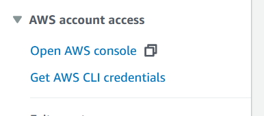

# Module 0 - Access the AWS Console

In this module, you will access AWS Console and make sure you are using the right AWS region.

## Access the AWS Console

### Self-paced using your AWS account
Open AWS Console by navigating to <a href="https://console.aws.amazon.com/" target="_blank">https://console.aws.amazon.com/</a>, then follow the steps in the [Choose the right AWS Region](#choose-the-right-aws-region) section further down on this page. 

### AWS Event using Workshop Studio
If you're running these labs as part of an AWS led event, we will be using Workshop Studio to provision temporary accounts for you, with everything you need to complete the workshop pre-provisioned. While there are some limits to these accounts, we do encourage you experiment and try out a few things!

1. Browse to [**Workshop Studio**](https://catalog.us-east-1.prod.workshops.aws/), and click **Get Started**. Alternatively, use the direct URL provided by your facilitator to access the event.

2. Select **Email one-time password (OTP)**, then enter your email address. Your facilitator should have whitelisted your email address and/or email domain to allow access to the event. Click **Send passcode**.

	

3. When you receive the email, copy the passcode into the text box, and click **Sign In**.

	

4. If you've been provided with a direct URL, you can skip this step. Otherwise, enter the event code provided by your facilitator.

	

5. Review the Terms and Conditions, mark the checkbox next to I agree... and click Join event

	

6. You'll see the steps for the workshop on the left. To access your AWS account, click **Open AWS console** in the bottom left hand corner. You may want to copy this sign-in url and open the console in a new window or browser.

	

You should now have access to your temporary AWS account. Note that this is a temporary account and will be cleaned up when the event is terminated. In Workshop Studio, you should see a notice with the time remaining for the account.

	

## Choose the right AWS Region

In the upper-right corner of the AWS Management Console, make sure you are in the **US East (N. Virginia) [us-east-1]** AWS region.

## You have completed Module 0
Proceed to [Module 1:  Configure SageMaker Studio](../01_configure_sagemaker_studio/README.md).
