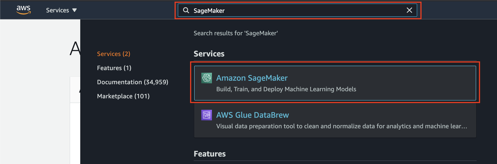
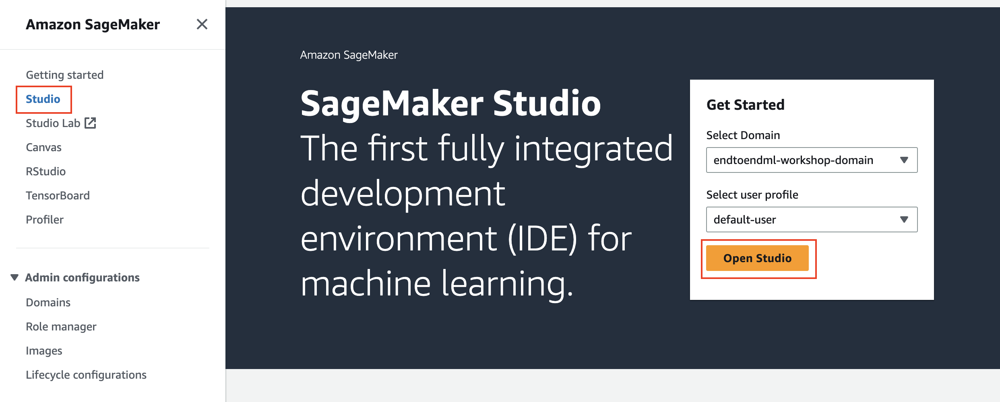

# Module 0: Open Amazon SageMaker Studio

1. In the AWS Management Console, search for "SageMaker" and select Amazon SageMaker in the results.	

2. You’ll be taken to the SageMaker console. Click on **Studio** in the left sidebar menu. The Get Started box on the right should show the name of the domain and default user profile. Select **Open Studio**.	

	
3. Once SageMaker Studio loads, proceed to <a href="../01_build_and_train/README.md">Module 1: Build and train models</a>.
