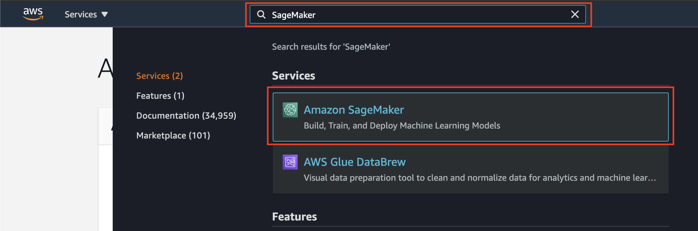
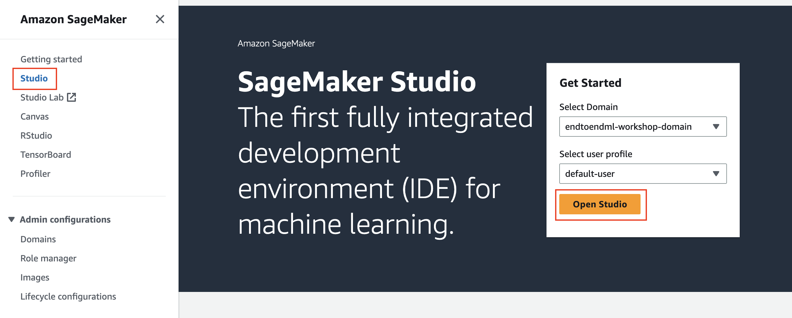
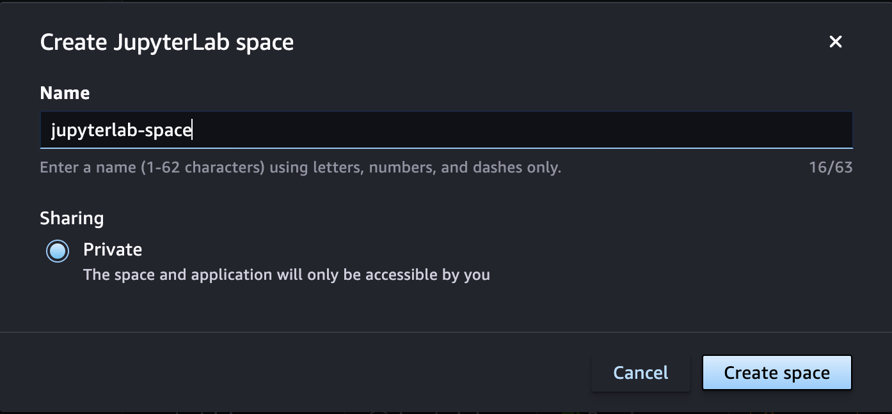
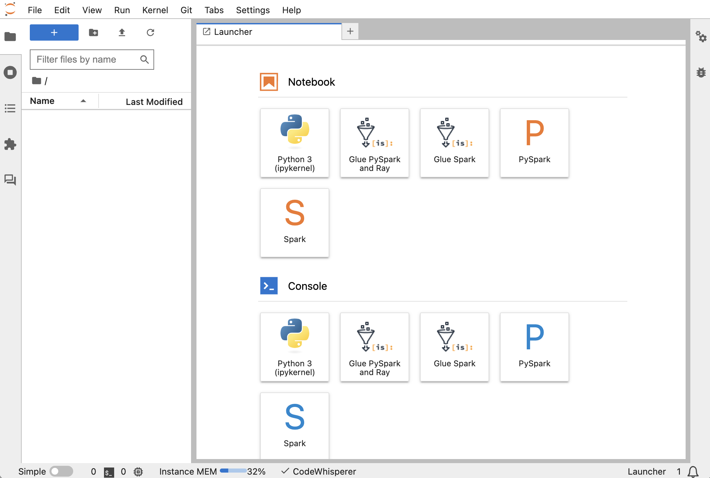

# Module 0: Prepare Amazon SageMaker Studio

In this module, you will open Amazon SageMaker Studio and clone this GitHub repository in your SageMaker Studio environment.

## Open Amazon SageMaker Studio

1. In the AWS Management Console, search for "SageMaker" and select Amazon SageMaker in the results.
	


2. You’ll be taken to the Amazon SageMaker dashboard. Click on **Studio** in the left sidebar menu. The Get Started box on the right should show the name of the domain and default user profile. Select **Open Studio**.	

	
3. Amazon SageMaker Studio will load. In this module (module 1), you will use a [JupyterLab space](https://docs.aws.amazon.com/sagemaker/latest/dg/studio-updated-jl.html), a private space within SageMaker Studio that manages the storage and compute resources needed to run the JupyterLab application. The JupyterLab application is a web-based interactive development environment (IDE) for notebooks, code, and data. Launch the JupyterLab application by clicking on the highlighted button under **Applications**, then choose **Create JupyterLab space**.  


5. In the dialog box that opens, enter a name for the new space, such as `jupyterlab-space`. Then choose **Create space**.



6. A new page shows the settings for the new JupyterLab space you created. Wait for a few seconds until the **Run space** button becomes active. Then run the space.  


7. Choose the **Open JupyterLab** when it appears.


8.  The JupyterLab IDE will load. 




## Clone the GitHub repository

1. In the **File** menu, choose **New >> Terminal**

	

	This will open a terminal window in the Jupyter interface.

2. Execute the following command in the terminal:

	```
		git clone https://github.com/aws-samples/amazon-sagemaker-build-train-deploy.git
	```

    The repository will be cloned to your user home and will appear in the file browser panel as shown below:
    
    
	
3. Browse to the folder **01_build_and_train** and open the file **01_build_and_train.ipynb**.


    
4. If a kernel is not automatically selected for your notebook, choose the kernel by clicking on the **Kernel** button on the top-right and them selecting the **Data Science 3.0** image and **Python 3** kernel as shown below:

    
    
    


## Continue the workshop in the SageMaker Studio environment

Continue the workshop by following the instructions in **01_build_and_train.ipynb** notebook you just opened in the SageMaker Studio environment.
