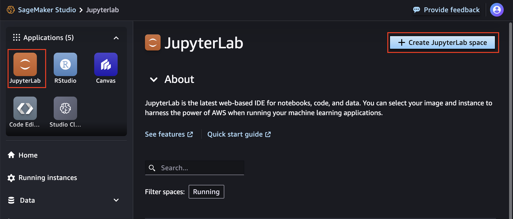
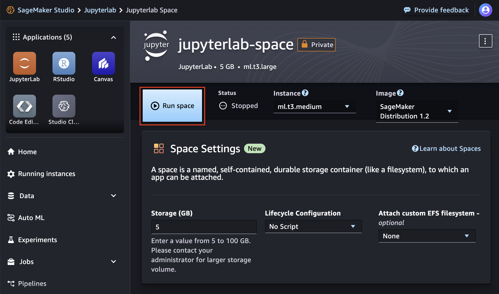

# Module 1: Build and train models

In this module, you will create a JupyterLab space in SageMaker Studio and clone this GitHub repository in that space. You will then build and train models using a Jupyter notebook in the newly created JupyterLab space. 

The JupyterLab application is a web-based interactive development environment (IDE) for notebooks, code, and data. A [JupyterLab space](https://docs.aws.amazon.com/sagemaker/latest/dg/studio-updated-jl.html) is a private space within SageMaker Studio that manages the storage and compute resources needed to run the JupyterLab application. 

## Create a JupyterLab space in SageMaker Studio

1.  In SageMaker Studio, launch the JupyterLab application by clicking on the **JupyterLab** button under **Applications**, then choose **Create JupyterLab space**.  

	

2. In the "Create JupyterLab space" dialog box, enter a name for the new space, such as `jupyterlab-space`. Then choose **Create space**.

	

3. A new page shows the settings for the new JupyterLab space you created. Wait for a few seconds until the **Run space** button becomes active. Then run the space.  

	

4. Choose the **Open JupyterLab** when it appears.

	

5.  The JupyterLab IDE will load. 

	


## Clone the GitHub repository

1. In the **File** menu, choose **New >> Terminal**

	

	This will open a terminal window in the Jupyter interface.

2. Execute the following command in the terminal:

	```
	git clone https://github.com/aws-samples/amazon-sagemaker-build-train-deploy.git
	```

    The cloned repository folder will appear in the file browser panel as shown below:
    
    
	

## Open Module 1's notebook in JupyterLab IDE

1. Browse to the folder **01_build_and_train** and open the notebook **01_build_and_train.ipynb**.

	

2. Follow the instructions in the Jupyter notebook.

## View SageMaker's training jobs created during experimentation
1. Go back to the SageMaker Studio tab/window in the browser where you ran the JupyterLab application from when you started this module.

2. From the sidebar meny, choose **Jobs >> Training**.

3. The list pane on the right will display the jobs created by running the cells in the notebooks. More specifically, you will observe at least two training jobs, whose names start with `amzn-sm-btd-`. SageMaker SDK created and ran the preprocessing and training jobs because of the presence of the @remote decorator. Note that the @remote decorator runs all of these steps as "training jobs".

4. Feel free to explore the details of those training jobs. The details pane provides additional information, such as the run time (in seconds), the location of input and output artifacts in Amazon S3, and the training image used by SageMaker training jobs. 

	

## Proceed to Module 2

You have completed Module 1: Build and train models. Please proceed to [Module 2: Deploy the models](../02_deploy/README.md).