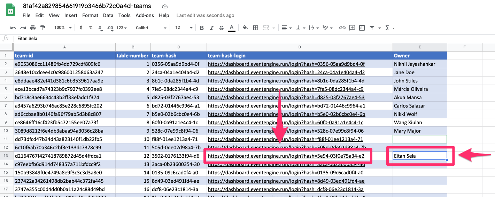
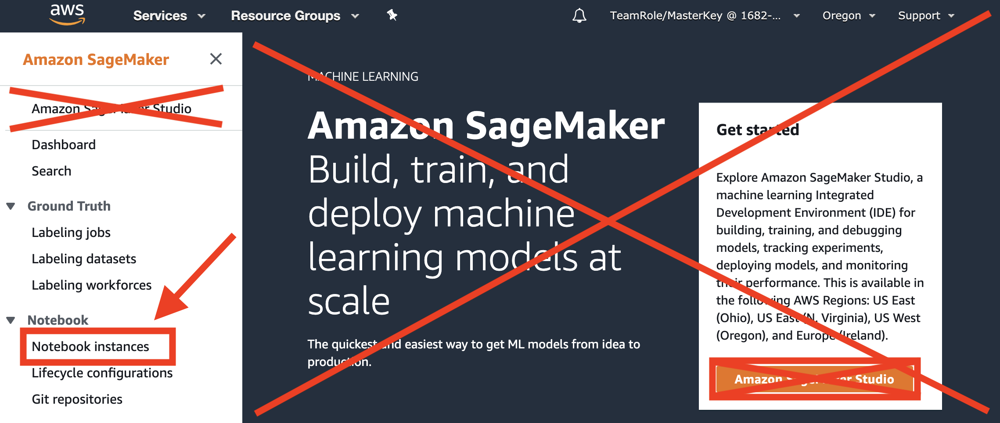
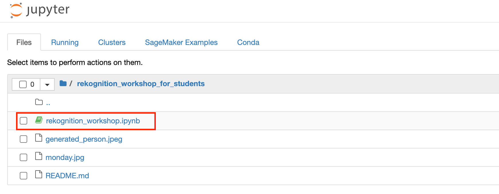

#Amazon SageMaker Hands-On Workshop

# Workshop Instructions
_Note:  This workshop will create an ephemeral AWS acccount for each attendee.  This ephemeral account is not accessible after the workshop.  You can, of course, clone this GitHub repo and reproduce the entire workshop in your own AWS Account._

## 0. Logout of All AWS Consoles Across All Browser Tabs
If you do not logout of existing AWS Consoles, things will not work properly.

_Please logout of all AWS Console sessions in all browser tabs._

## 1. Login to the Workshop Portal (aka Event Engine). 
Choose an empty cell, wait for 5 seconds to see no one took it, and write your name.

Copy the team-hash-login

Paste the team-hash-login to a new browser window. 

Choose the Accept Terms & Login. 

## 2. Login to the **AWS Console**

Take the defaults and click on **Open AWS Console**. This will open AWS Console in a new browser tab.

If you see this message, you need to logout from any previously used AWS accounts.

_Please logout of all AWS Console sessions in all browser tabs._

Double-check that your account name is similar to `TeamRole/MasterKey` as follows:

If not, please logout of your AWS Console in all browser tabs and re-run the steps above!

## 3. Launch a SageMaker Notebook Instance

Open the [AWS Management Console](https://console.aws.amazon.com/console/home)

**Note:** This workshop has been tested on the US East (N. Virginia) (us-east-1) region. Make sure that you see **N.Virginia** on the top right hand corner of your AWS Management Console. If you see a different region, click the dropdown menu and select US East (N. Virginia).

In the AWS Console search bar, type `SageMaker` and select `Amazon SageMaker` to open the service console.

. 

Select `Notebook instances`.

.

## 4. Start the Jupyter Notebook
You should see a Notebook instance in status `InService`.

Select `Open Jupyter`. 

## 5. Start the Workshop!

Click the `rekognition_workshop.ipynb` in your Jupyter notebook and start the workshop!

