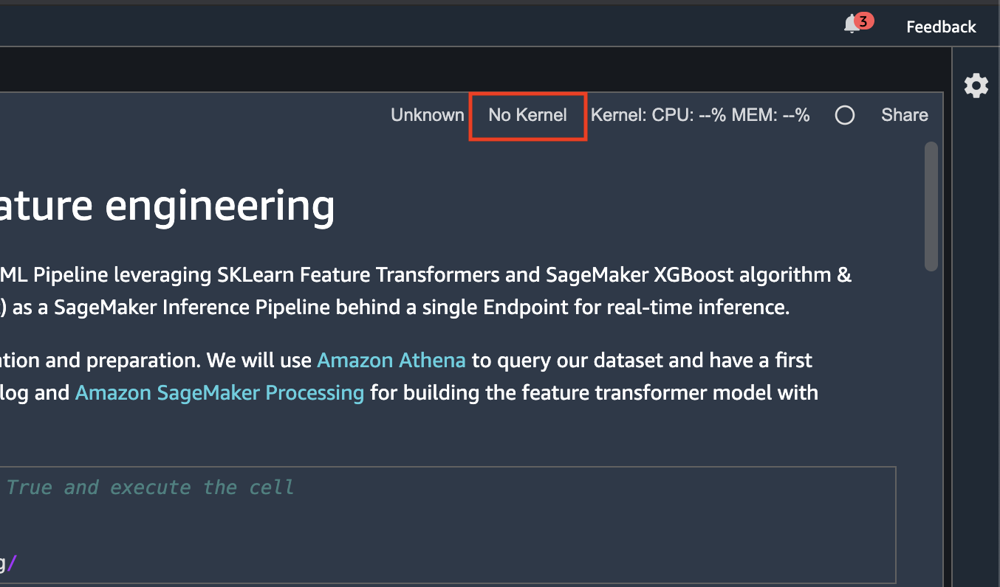

# Module 1: Configure Amazon SageMaker Studio

In this module, you will open Amazon SageMaker Studio and clone this GitHub repository in your SageMaker Studio environment.

## Open Amazon SageMaker Studio

1. In the AWS Management Console, search for "SageMaker" and select Amazon SageMaker in the results.
	
	

2. You’ll be taken to the Amazon SageMaker dashboard. Click on **Domains** in the left menu. From the Domains list, choose **endtoendml-workshop-domain**.
	
	

3. On the next screen, click on the **Launch App** dropdown button associated with __default-user__, then choose the **Studio** link.

	
	
4. Amazon SageMaker Studio will load. Then you will be redirected to the Studio interface.

	


## Clone the GitHub repository

1. In the **File** menu, choose **New >> Terminal**

	

	This will open a terminal window in the Jupyter interface.

2. Execute the following command in the terminal:

	```
		git clone https://github.com/aws-samples/amazon-sagemaker-build-train-deploy.git
	```

    The repository will be cloned to your user home and will appear in the file browser panel as shown below:
    
    
	
3. Browse to the folder **01_configure_sagemaker_studio** and open the file **01_configure_sagemaker_studio.ipynb**. 

    
    
4. If a kernel is not automatically selected for your notebook, choose the kernel by clicking on the **Kernel** button on the top-right and them selecting the **Data Science 3.0** image and **Python 3** kernel as shown below:

    
    
    


## Continue the workshop in the SageMaker Studio environment

Continue the workshop by following the instructions in **01_configure_sagemaker_studio.ipynb** notebook you just opened in the SageMaker Studio environment.

