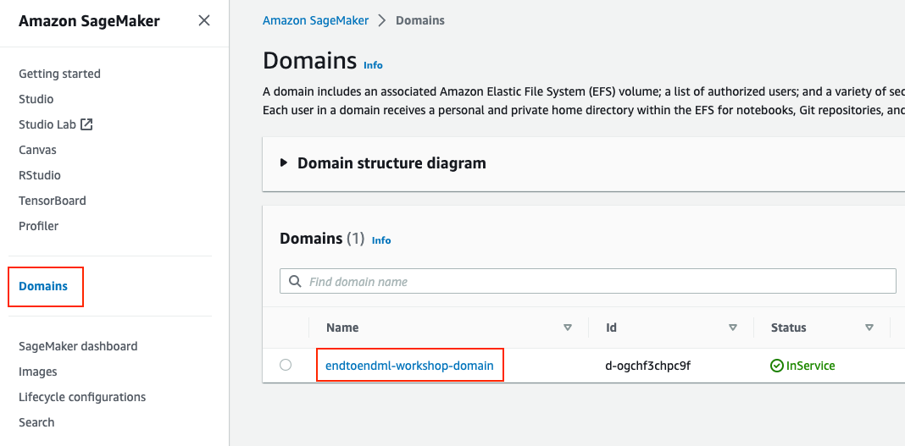
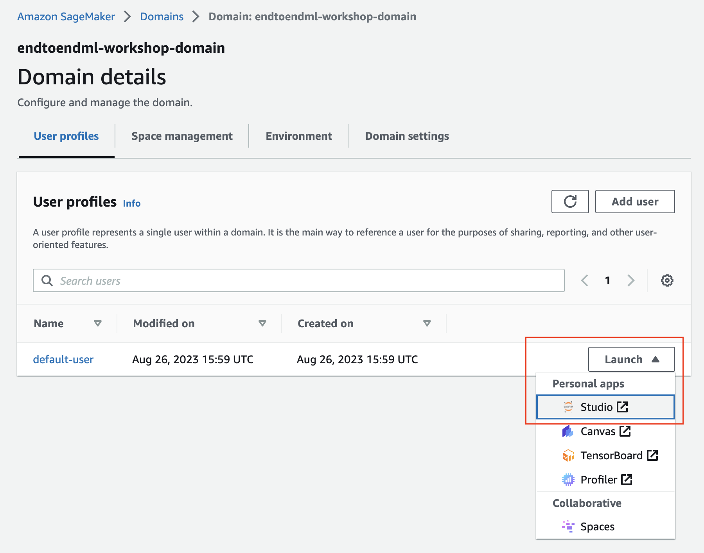
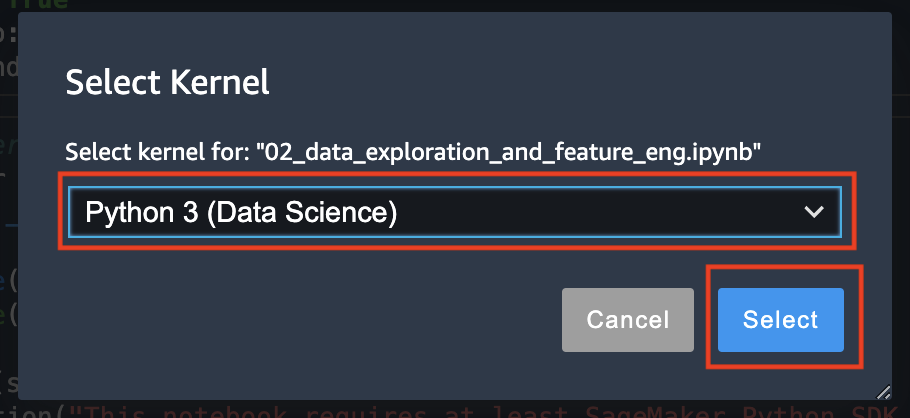

# Configure Amazon SageMaker Studio

## Overview

Amazon SageMaker is a fully-managed service that enables developers and data scientists to quickly and easily build, train, and deploy machine learning models at any scale.

Amazon SageMaker removes the complexity that holds back developer success with each of these steps; indeed, it includes modules that can be used together or independently to build, train, and deploy your machine learning models.

In this section, you will access AWS Console and Amazon SageMaker Studio, and clone this repository in your SageMaker Studio environment.

## Access the AWS Console

### Self-paced using your AWS account
Open AWS Console by navigating to <a href="https://console.aws.amazon.com/" target="_blank">https://console.aws.amazon.com/</a>, then follow the steps in the [Open SageMaker Studio](#open-amazon-sagemaker-studio) section further down on this page. 

### AWS Event using Workshop Studio
If you're running these labs as part of an AWS led event, we will be using Workshop Studio to provision temporary accounts for you, with everything you need to complete the workshop pre-provisioned. While there are some limits to these accounts, we do encourage you experiment and try out a few things!

1. Browse to [**Workshop Studio**](https://catalog.us-east-1.prod.workshops.aws/), and click **Get Started**. Alternatively, use the direct URL provided by your facilitator to access the event.

2. Select **Email one-time password (OTP)**, then enter your email address. Your facilitator should have whitelisted your email address and/or email domain to allow access to the event. Click **Send passcode**.
<p align="center">
	
</p>

3. When you receive the email, copy the passcode into the text box, and click **Sign In**.

<p align="center">
	
</p>

4. If you've been provided with a direct URL, you can skip this step. Otherwise, enter the event code provided by your facilitator.

<p align="center">
	
</p>

5. Review the Terms and Conditions, mark the checkbox next to I agree... and click Join event

<p align="center">
	
</p>

6. You'll see the steps for the workshop on the left. To access your AWS account, click **Open AWS console** in the bottom left hand corner. You may want to copy this sign-in url and open the console in a new window or browser.

<p align="center">
	
</p>

You should now have access to your temporary AWS account. Note that this is a temporary account and will be cleaned up when the event is terminated. In Workshop Studio, you should see a notice with the time remaining for the account.

<p align="center">
	
</p>

4. In the upper-right corner of the AWS Management Console, make sure you are in the **US East (N. Virginia) [us-east-1]** AWS region.

## Open Amazon SageMaker Studio
Amazon SageMaker Studio has been pre-configured in the AWS Account. In this section we will open Studio and clone the repository.

1. In the AWS Management Console, search for "SageMaker" and select Amazon SageMaker in the results.
	
	

2. You’ll be placed in the Amazon SageMaker dashboard. Click on **SageMaker Doman > Studio** in the left menu.
	
	
	
3. In the next screen, click on the **Launch App** dropdown button associated to __defaultuser__, then right-click on **Studio** and open the link in a new tab.

	
	
3. Amazon SageMaker Studio will load. Then you will be redirected to the Studio interface.

	


## Clone the repository

1. In the **File** menu, choose **New >> Terminal**

	

	This will open a terminal window in the Jupyter interface.

2. Execute the following commands in the terminal

	```bash
	git clone https://github.com/aws-samples/amazon-sagemaker-build-train-deploy.git
	```
    The repository will be cloned to your use home and will appear in the file browser panel as shown below:
    
    
	
3. Browse to the folder **01_configure_sagemaker_studio** and open the file **01_configure_sagemaker_studio.ipynb**. 
    
    
4. If a kernel is not automatically selected for your notebook, choose the kernel by clicking on the **Kernel** button on the top-right and them selecting the **Data Science 3.0** image and **Python 3** kernel as shown below:

    
    
    

5. Follow the instructions in the notebook [**01_configure_sagemaker_studio.ipynb**](./01_configure_sagemaker_studio.ipynb).
