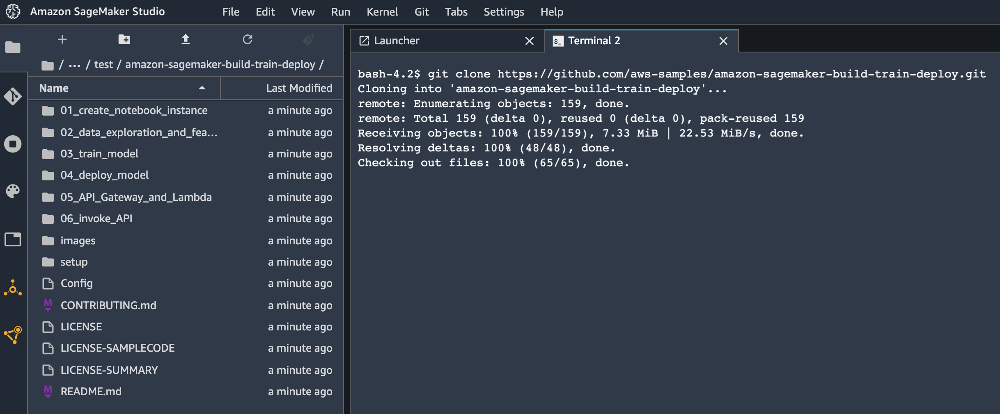

# Open Amazon SageMaker Studio and clone the repository

## Overview

Amazon SageMaker is a fully-managed service that enables developers and data scientists to quickly and easily build, train, and deploy machine learning models at any scale.

Amazon SageMaker removes the complexity that holds back developer success with each of these steps; indeed, it includes modules that can be used together or independently to build, train, and deploy your machine learning models.

In this section, we will walk you through accessing the AWS Console, Amazon SageMaker Studio, and cloning this repository for executiong next modules.

## Access the AWS Console

If you are not at an AWS instructor-led event (workshop, etc.) and you are using your own AWS account, just access the AWS Console at <a href="https://console.aws.amazon.com/" target="_blank">https://console.aws.amazon.com/</a>. Otherwise, please follow the instructions below.

1. Access the Event Engine dashboard at <a href="https://dashboard.eventengine.run" target="_blank">https://dashboard.eventengine.run</a> and input **the hashcode provided by the workshop instructors**. Then click on **Accept Terms & Login**.

	

2. Follow the Event Engine authentication process using your email and receiving a one-time password as shown below:

	
	
	
	
	

3. After successful sign-in, you will be redirected to the **Team Dashboard**. Click on the **AWS Console** button and then on **Open AWS Console** to access the AWS Console as shown below:
	
	
    
	

4. In the upper-right corner of the AWS Management Console, confirm you are in the desired AWS region. For the instructions of these workshop we will assume using the **EU West (Ireland)** [eu-west-1], but feel free to change the region at your convenience.

	> The only constraints for changing AWS region are that we keep consistent the region settings for all services used and services are available in the selected region (please check in case you plan to execute this workshop in another AWS region).


## Open Amazon SageMaker Studio
Amazon SageMaker Studio has been pre-configured in the AWS Account. In this section we will open Studio and clone the repository.

1. In the AWS Management Console, search for "SageMaker" and select Amazon SageMaker in the results.
	
	

2. You’ll be placed in the Amazon SageMaker dashboard. Click on **SageMaker Doman > Studio** in the left menu.
	
	
	
3. In the next screen, click on the **Launch App** dropdown button associated to __defaultuser__, then right-click on **Studio** and open the link in a new tab.

	
	
3. Amazon SageMaker Studio will load. Then you will be redirected to the Studio interface.

	


## Clone the repository

1. In the **File** menu, choose **New >> Terminal**

	

	This will open a terminal window in the Jupyter interface.

2. Execute the following commands in the terminal

	```bash
	git clone https://github.com/aws-samples/amazon-sagemaker-build-train-deploy.git
	```
    The repository will be cloned to your use home and will appear in the file browser panel as shown below:
    
    
	
3. Browse to the folder **01_configure_sagemaker_studio** and open the file **01_configure_sagemaker_studio.ipynb**. 
    
    
4. If a kernel is not automatically selected for your notebook, choose the kernel by clicking on the **Kernel** button on the top-right and them selecting the **Data Science 3.0** image and **Python 3** kernel as shown below:

    
    
    

5. Follow the instructions in the notebook **01_configure_sagemaker_studio.ipynb**.
