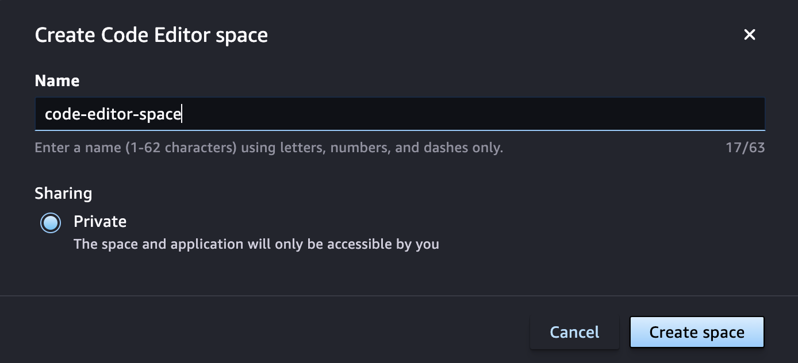
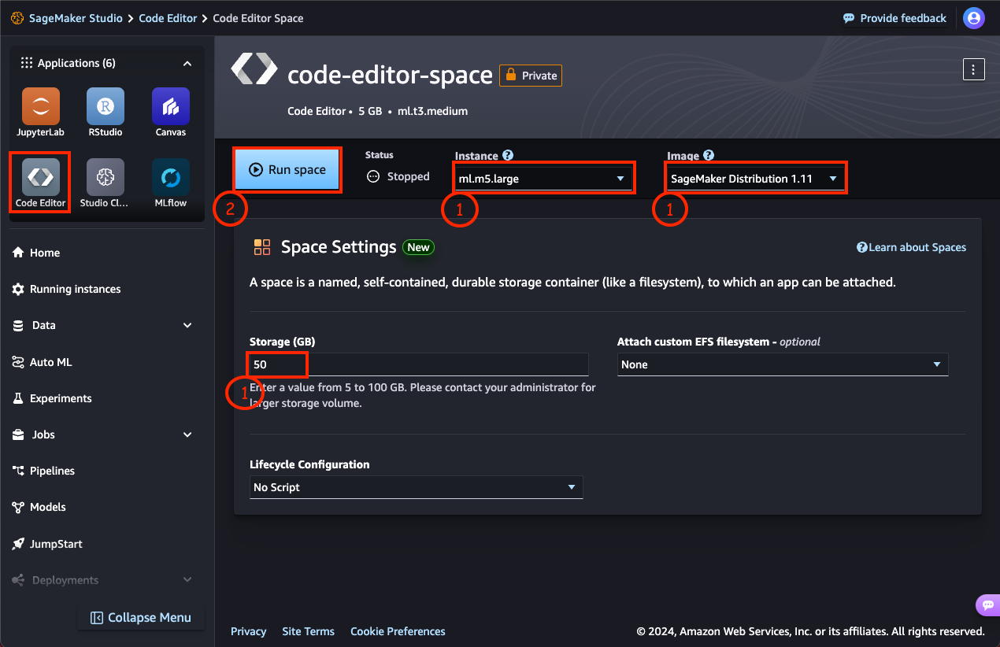

# Module 2: Deploy the models

In this module, you will create a Code Editor space in SageMaker Studio and clone the GitHub repository, this time in the Code Editor environment. You will then deploy the trained models on a SageMaker inference endpoint using a deployment script written in Python.

The [Code Editor](https://docs.aws.amazon.com/sagemaker/latest/dg/code-editor.html), which is based on [Code-OSS, Visual Studio Code - Open Source](https://github.com/microsoft/vscode#visual-studio-code---open-source-code---oss) and fully integrated with SageMaker Studio, allows you to write, test, debug, and run your analytics and machine learning code using the popular lightweight IDE.

## Create a Code Editor space in SageMaker Studio

1. In SageMaker Studio, launch the Code Editor application by clicking on the **Code Editor** button under **Applications**, then choose **Create Code Editor space**.  

	

2. In the "Create Code Editor space" dialog box, enter a name for the new space, such as `code-editor-space`. Then choose **Create space**.

	

3. A new page shows the settings for the new Code Editor space you created. Wait for a few seconds until the **Run space** button becomes active. Then run the space.  

	

4. Choose the **Open Code Editor** when it appears.

	

5.  The Code Editor IDE will load.

	


## Clone the GitHub repository

1. From the **Explorer** menu, choose **Terminal >> New Terminal** to open a terminal window in the Code Editor interface.

	

2. Run the following command in the terminal:

	```
	git clone https://github.com/aws-samples/amazon-sagemaker-build-train-deploy.git
	```
    
	

3. Choose **Open Folder** button. Alternatively, from the Explorer menu, choose **File >> Open Folder**. In the **Open folder** dialog box, choose **amazon-sagemaker-built-train-deploy**. Then Choose **OK**.

	

4. You will see a dialog box that asks "Do you trust the authors of the files in this folder?". 

	> When using SageMaker Code Editor or any other code editor, always make sure you know and trust the authors of the code in the folder you are opening.

	Choose **Yes, I trust the authors**.

	


## Deploy the model to an inference endpoint

1. In the Explorer window, browse to the folder **02_deploy** and open the Python file **deploy.py**.

	

2. Make yourself familiar with the deployment steps. The deployment script performs the following steps:
	- Load the featurizer (SKLearn) and logistic regression (XGBoost) models from the S3 bucket. The jobs you ran in Module 1 has stored the models in the S3 bucket.
	- Prepare the model for deployment using the [ModelBuilder](https://docs.aws.amazon.com/sagemaker/latest/dg/how-it-works-modelbuilder-creation.html) in SageMaker Python SDK. The ModelBuilder reduces complexity of setup and deployment of models, which involves choosing a model image, setting up the endpoint configuration, coding your serialization and deserialization functions to transfer data to and from server and client, identifying model dependencies, and uploading them to Amazon S3.
	- Build a [PipelineModel](https://sagemaker.readthedocs.io/en/stable/api/inference/pipeline.html), which is a pipeline of SageMaker Model instances (in this case, the featurizer and logistic regression models).
	- Deploy the pipeline model on a real-time inference endpoint. Learn more about [Deploying models for inference](https://docs.aws.amazon.com/sagemaker/latest/dg/deploy-model.html). 


3. Open the Terminal window again. If you have closed it or cannot locate it, open the Explorer menu and choose **Terminal >> New Terminal**.

4. In the Terminal window, run the following command to install the dependencies required by the deployment script.

	```
	cd ~/amazon-sagemaker-build-train-deploy/02_deploy && pip install -r requirements.txt
	```
	

5. Once all dependencies are installed and the previous command has finished executing, choose the **Run Python File** icon as displayed below:

	

	The deployment script will deploy the model to a SageMaker inference endpoint. Note that the deployment process is non-blocking, so after the script finishes executing, the deployment will take a few minutes to complete.

	

6. Check the deployment progress by going back to SageMaker Studio and choosing **Deployment >> Endpoints** from the menu on the left. Locate the endpoint whose name starts with `sagemaker-btd-endpoint-`. Choose the **Refresh** link every couple of minutes and wait until the **Status** column shows **InService**.

	

7. Make note of the name of the SageMaker endpoint you have just deployed. You will need the name in the next section. The endpoint name starts with `sagemaker-btd-endpoint-`.

## Perform predictions using the deployed model

1. In the Explorer window, from folder **02_deploy**, open the Python file **test.py**.

	

2. Make yourself familiar with the test process in **test.py**:
	- The test script uses the **Predictor** class from SageMaker Python SDK to predict scores based on the input feature values. The model pipeline behind the inference endpoint will first use the featurizer model to preprocess the features, and then pass the result to the XGBoost model to predict the score. 
	- Note that the test script expects the SageMaker Inference endpoint name as an input argument.

3. Go back to the Terminal window. If you have closed it or cannot locate it, open the Explorer menu and choose **Terminal >> New Terminal**.

4. Run the following commmand, replacing ENDPOINT_NAME with the name you made a note of in the previous section.

	```
	cd ~/amazon-sagemaker-build-train-deploy/02_deploy && python3 test.py ENDPOINT_NAME
	```

	

	You should see two inference results in the Terminal window.


## Proceed to Module 3

You have completed Module 2: Deploy the models. Please proceed to [Module 3: Create a complete deployment pipeline](../03_workflow/README.md).