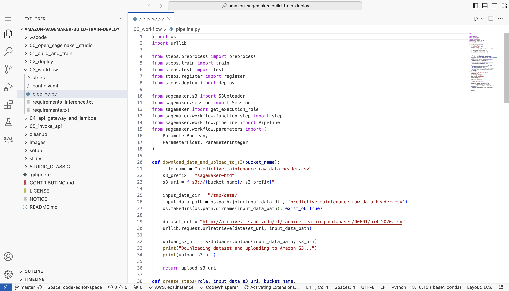
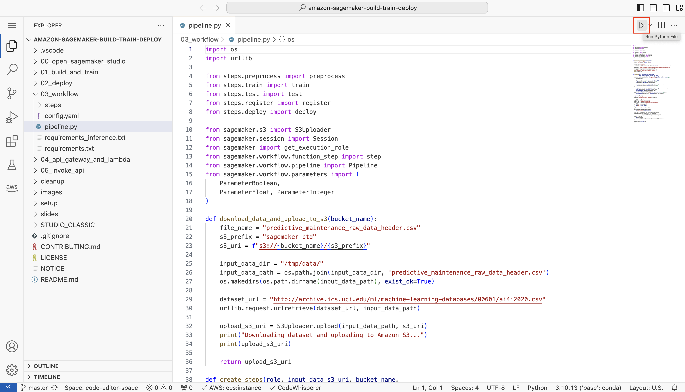
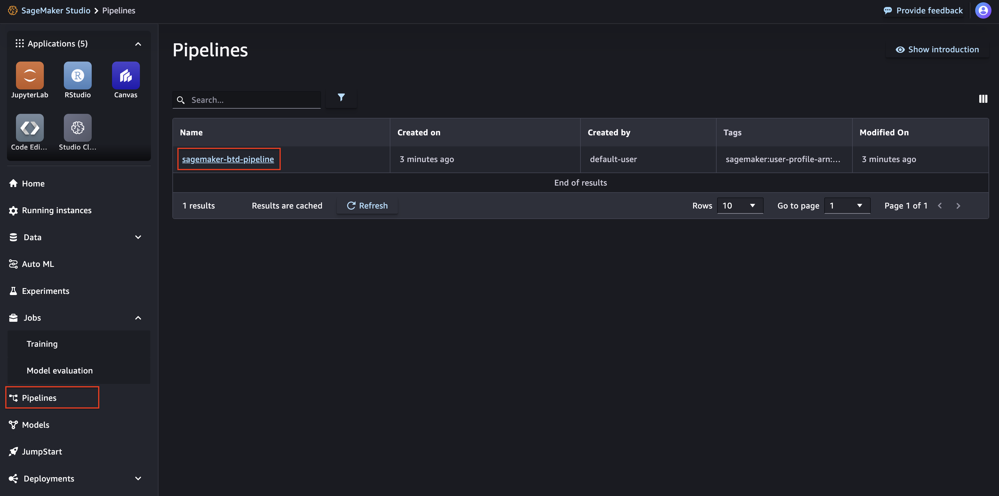
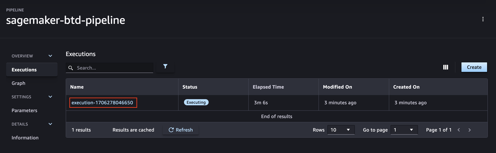
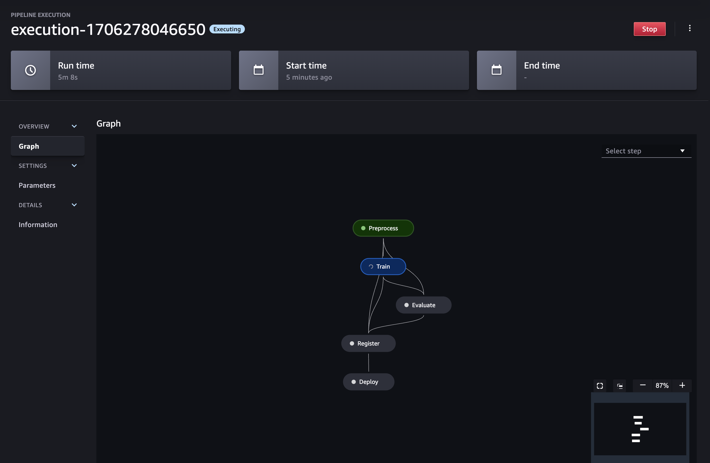
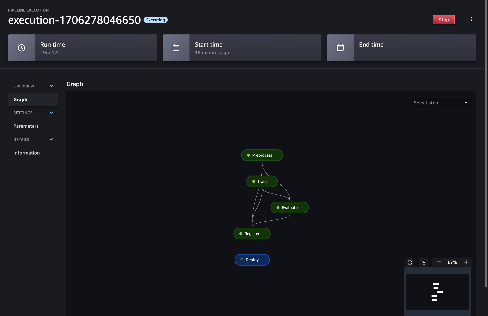
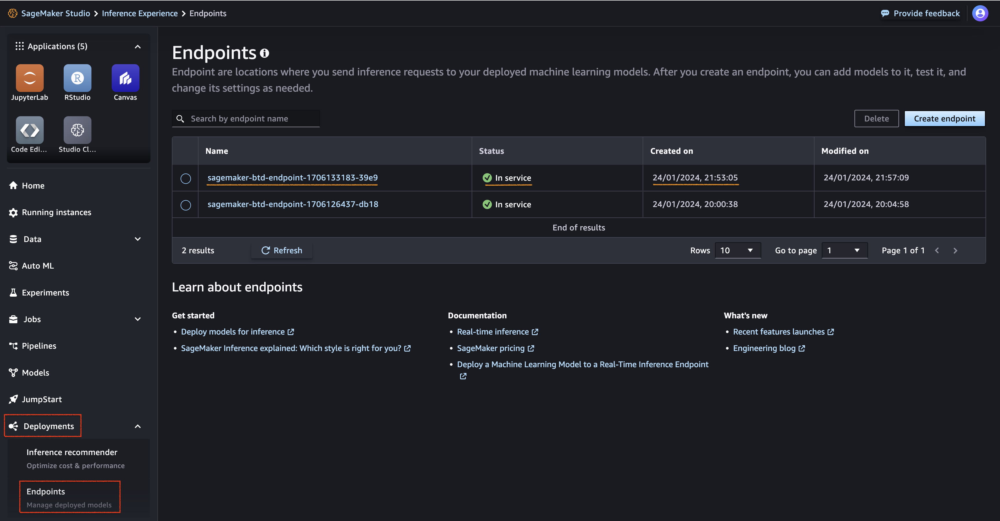

# Module 3: Create a complete deployment pipeline

In this module, you will create a SageMaker Pipeline using the @step decorator, a feature of SageMaker Pipelines that converts your local machine learning code into one or more pipeline steps. 

This capability allows you to write your ML function as you would for any ML project. After testing, you can convert the function to a SageMaker pipeline step by adding a @step decorator. You can then pass the output of the @step-decorated function call as a step to SageMaker Pipelines to create and run a pipeline. Using this approach, you can orchestrate existing Python functions that perform data processing, training and deployment to form a complete pipeline. For further information, read about the [pipelines step decorator](https://docs.aws.amazon.com/sagemaker/latest/dg/pipelines-step-decorator.html)

## Create and start the pipeline

1. In the Explorer window, from folder **03_workflow**, open the Python file **pipeline.py**.

    

2. Make yourself familiar with the code in **pipeline.py**. The script performs the following steps:
   - Download the raw dataset and upload to a location in Amazon S3.
   - Create an Amazon SageMaker Pipeline to orchestrate the execution of the ML workflow steps, which includes:
        - Data processing
        - Model training
        - Model evaluation
        - Registering model version in SageMaker Model Registr
        - Deploying the latest model version.
   - Execute the pipeline
  
3. Choose the **Run Python File** icon at the top right, as displayed below:

    

4. The Terminal window will show the progress of the execution. The last operation in the pipeline script will start the pipeline, and pipeline execution will continue in the background.

## Monitor pipline execution progress

1. Go back to SageMaker Studio and choose **Pipelines** from the menu on the left.

2. Choose the pipeline named **sagemaker-btd-pipeline** to display a list of executions for the pipeline.

    

3. Choose the last pipeline execution from the list.

    

4. The pipeline execution page includes a visual representation of the status. Wait until the pipeline execution is completed.

    

    

## Find the last deployed endpoint

1. In SageMaker Studio, choose **Deployment >> Endpoints** from the menu on the left. 

2. Locate the endpoints whose name starts with `amzn-sm-btd-endpoint-`. Find the last deployed endpoint (note the **Created on** field)

3. Make note of the endpoint name. You will need to use this name in the next module.

	

## Proceed to Module 4
You have completed Module 3: Create a complete deployment pipeline. Please proceed to [Module 4: Build an HTTP API using Amazon API Gateway and AWS Lambda](../04_api_gateway_and_lambda/README.md).