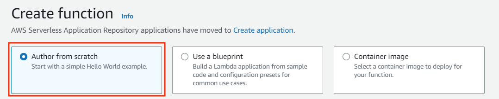
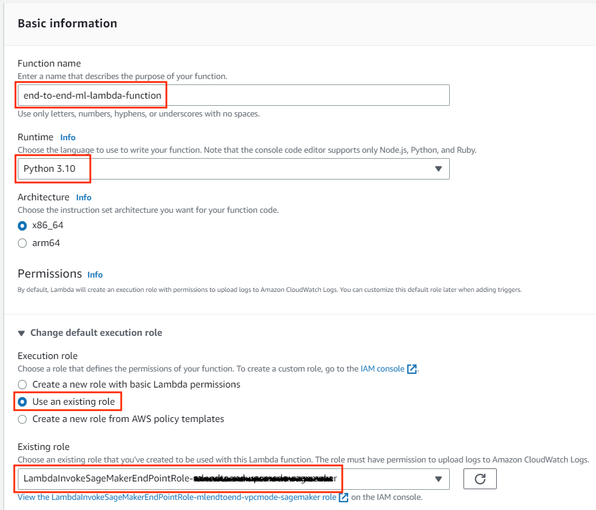
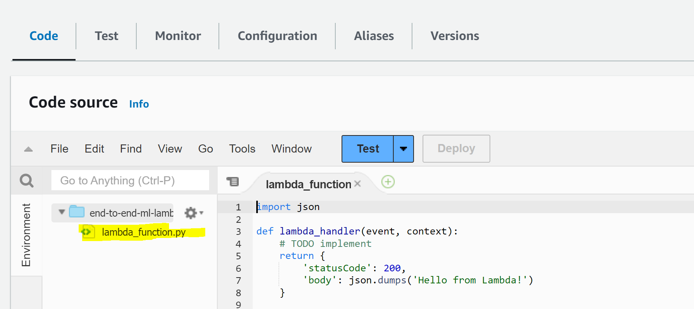
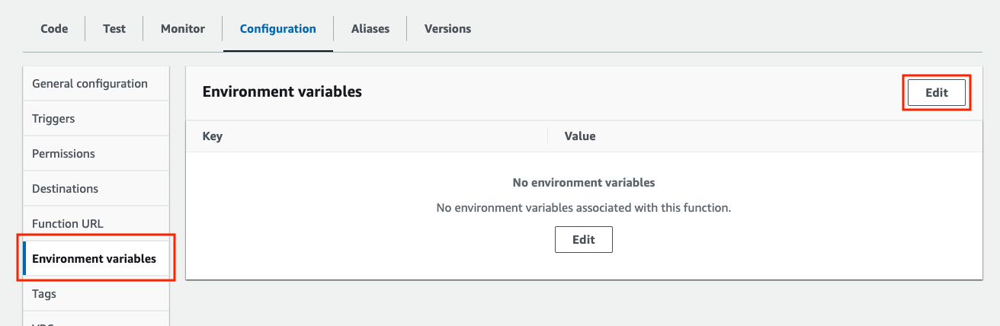
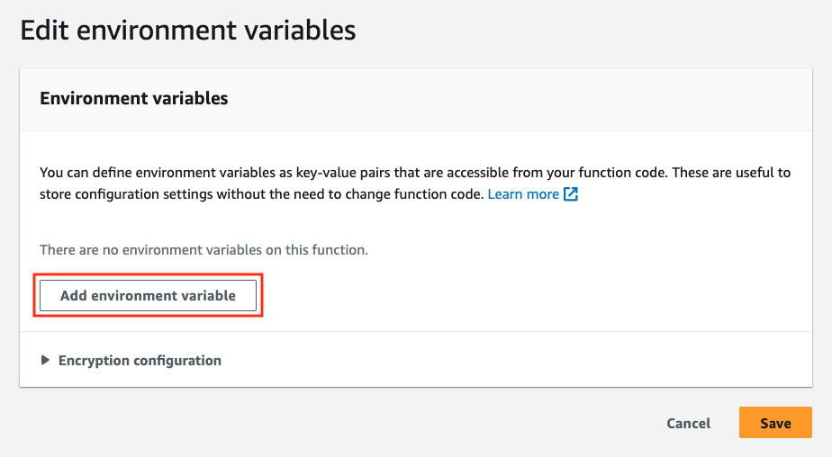
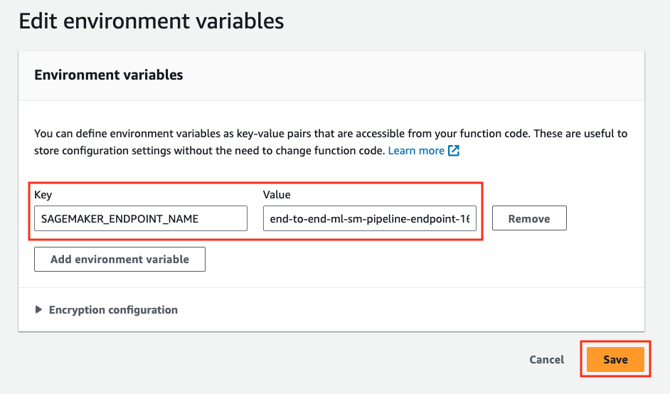
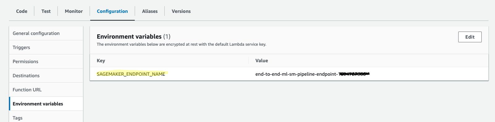
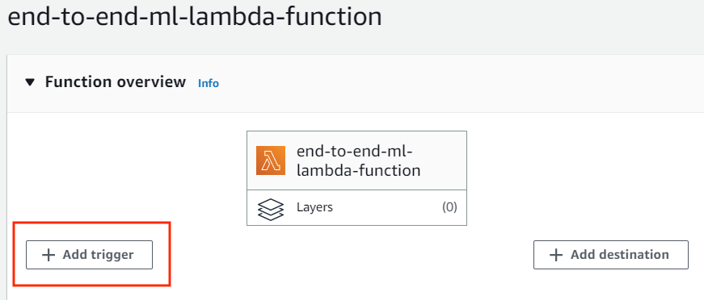
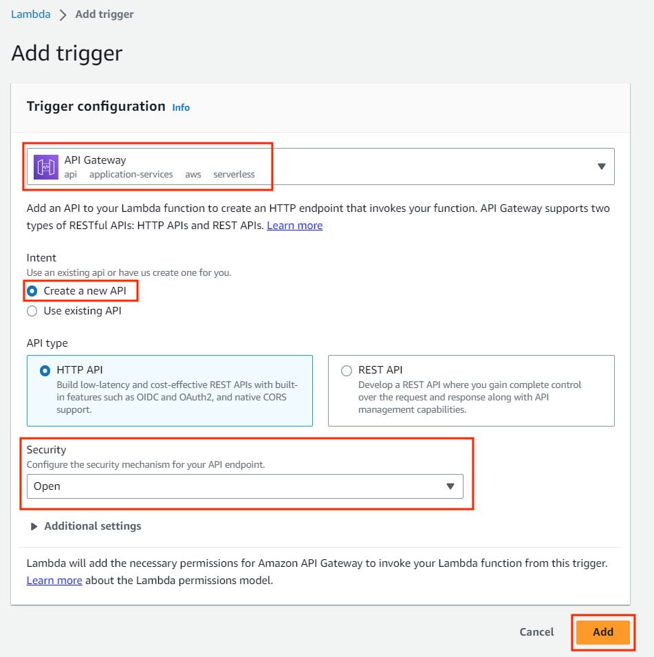
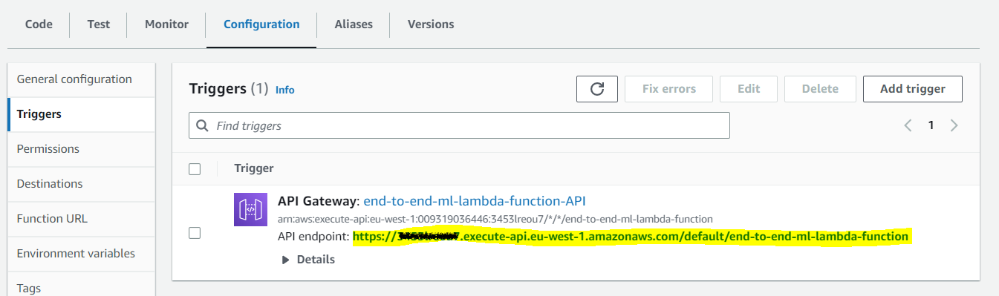

# Module 6: Build a HTTP API using Amazon API Gateway and AWS Lambda

> ⚠️ This module does not have a Jupyter notebook. 

After deploying the model to a fully-managed Amazon SageMaker endpoint, you are ready to build a HTTP API that will be invoked by client applications to perform inferences.

Although you can call the Amazon SageMaker endpoint directly, adding an HTTP API in Amazon API Gateway in front of the SageMaker endpoint provides more control over user authorization, usage profiles, throttling, API versioning, etc. 

After building the HTTP API, the request flow would be as follows:

1. The client application send a HTTP POST request to the Amazon API Gateway endpoint.
2. The Amazon API Gateway application passes the request to an AWS Lambda function, which processes the request and calls the Amazon SageMaker HTTPS endpoint where the model is hosted.
3. Lambda function receives the inference response from Amazon SageMaker endpoint and send it back to the client via Amazon API Gateway.

Let's start building the HTTP API.

## Create the AWS Lambda function

1. Open **AWS Console** and go to the **Lambda** service.
2. In the **Functions** section, click on **Create function**.
3. Select **Author from scratch**.



4. Type **end-to-end-ml-lambda-function** in the function name textbox. Select **Use an existing role** and then choose the IAM role whose name starts with **_LambdaInvokeSageMakerEndpointRole_** from the **Existing Role** dropdown. This IAM role, which has been created by the workshop setup process, has permission to invoke the Amazon SageMaker endpoint.



5. You are now redirected to the Lambda function page. In the **Function code** section, double click "lambda_function.py":



6. Replace the Lambda function code with with the following snippet, making sure that the indentation is matching:

```
# MIT No Attribution

# Copyright Amazon.com, Inc. or its affiliates. All Rights Reserved.

# Permission is hereby granted, free of charge, to any person obtaining a copy of
# this software and associated documentation files (the "Software"), to deal in
# the Software without restriction, including without limitation the rights to
# use, copy, modify, merge, publish, distribute, sublicense, and/or sell copies of
# the Software, and to permit persons to whom the Software is furnished to do so.

# THE SOFTWARE IS PROVIDED "AS IS", WITHOUT WARRANTY OF ANY KIND, EXPRESS OR
# IMPLIED, INCLUDING BUT NOT LIMITED TO THE WARRANTIES OF MERCHANTABILITY, FITNESS
# FOR A PARTICULAR PURPOSE AND NONINFRINGEMENT. IN NO EVENT SHALL THE AUTHORS OR
# COPYRIGHT HOLDERS BE LIABLE FOR ANY CLAIM, DAMAGES OR OTHER LIABILITY, WHETHER
# IN AN ACTION OF CONTRACT, TORT OR OTHERWISE, ARISING FROM, OUT OF OR IN

import os
import sys
import subprocess
subprocess.call('pip install numpy -t /tmp/ --no-cache-dir'.split(), stdout=subprocess.DEVNULL, stderr=subprocess.DEVNULL)
sys.path.insert(1, '/tmp/')
import numpy as np
import io

import boto3
import json

ENDPOINT_NAME = os.environ.get('SAGEMAKER_ENDPOINT_NAME')
runtime= boto3.client('runtime.sagemaker')

def build_response(status_code, response_body):
    print(f'Returning status code: {status_code}')
    print(f'Returning body: {response_body}')    

    response = {
                'statusCode': status_code,
                'headers': {
                    'Content-Type': 'application/json',
                    'Access-Control-Allow-Origin' : '*',
                    'Access-Control-Allow-Credentials' : 'true',
		            'Access-Control-Allow-Headers': '*'
                },
            }

    if response_body is not None:
        response['body'] = str(response_body)

    return response


def lambda_handler(event, context):
    print("Received event: " + json.dumps(event, indent=2))
    
    if 'requestContext' in event:
        if event['httpMethod'] == 'OPTIONS':
            return build_response(200, '')

        elif event['httpMethod'] == 'POST':
            turbine_data = event['body']
            
            response = runtime.invoke_endpoint(EndpointName=ENDPOINT_NAME,
                                               ContentType='text/plain',
                                               Body=turbine_data)
            print(response)
            result = np.load(io.BytesIO(response['Body'].read()))
            print(result)
            return build_response(200, result[0])
    
        else:
            return build_response(405, None)


```

When the Lambda function receives a POST request, it invokes the Amazon SageMaker endpoint with the _Body_ parameter set to the request body, and when it receives the inference results, it returns the response to the caller.

7. Click **Deploy** to save changes.

8.  The first line of code in the Lambda function after the import statements retrieves the name of the SageMaker Endpoint you deployed in the previous module from an environment variable named `SAGEMAKER_ENDPOINT_NAME`. You are now going to create that environment variable.

9. From the **Configuration** tab, choose **Environment variables**, then select **Edit**.



10. On the **Edit environment variables** screen, choose **Add environment variable**.

 

11. Enter `SAGEMAKER_ENDPOINT_NAME` as the **Key**. For the **Value**, use the SageMaker endpoint name you noted down in the previous module. The endpoint name starts with _end-to-end-ml-sm-pipeline-endpoint_.

  

12. Choose **Save**.

13. The environment variables section should now display the environment variable you just created.

  


## Create the Amazon API Gateway HTTP API

1. In the **Function overview** section, choose **Add trigger** and select **API Gateway** as the source.



2. Choose **Create a new API** and keep the API Type as **HTTP API**. In the **Security** section, choose **Open**, then choose **Add**.



3. Click on the **API Gateway** trigger and from the **Configuration** tab, make a note of _API endpoint_. You will need this in the next module.



> The API expects a POST HTTP request that contains a comma-delimited list of feature values in the body. If you try to naviagate to the API endpoint URL in the browser, the API will receive a GET request, so it will return HTTP status code 405 (Method Not Allowed).

## You have completed module 4

You have now created an HTTP API that accepts inference requests. 

Proceed to module 5 to test the new HTTP API endpoint.