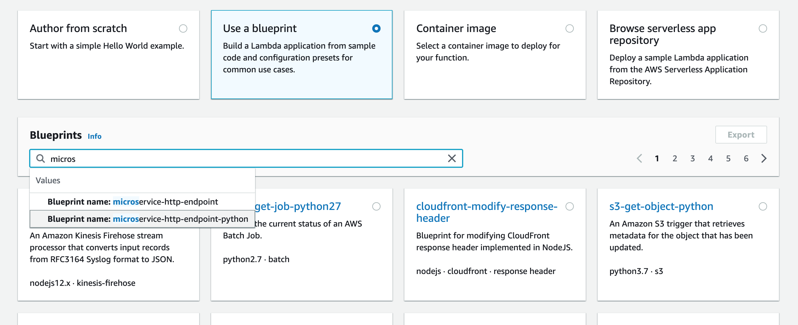
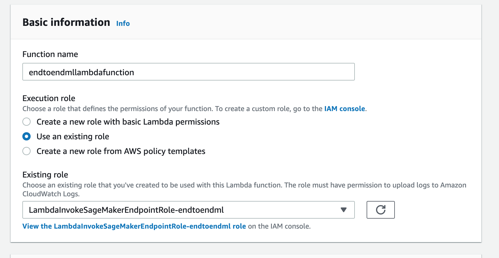
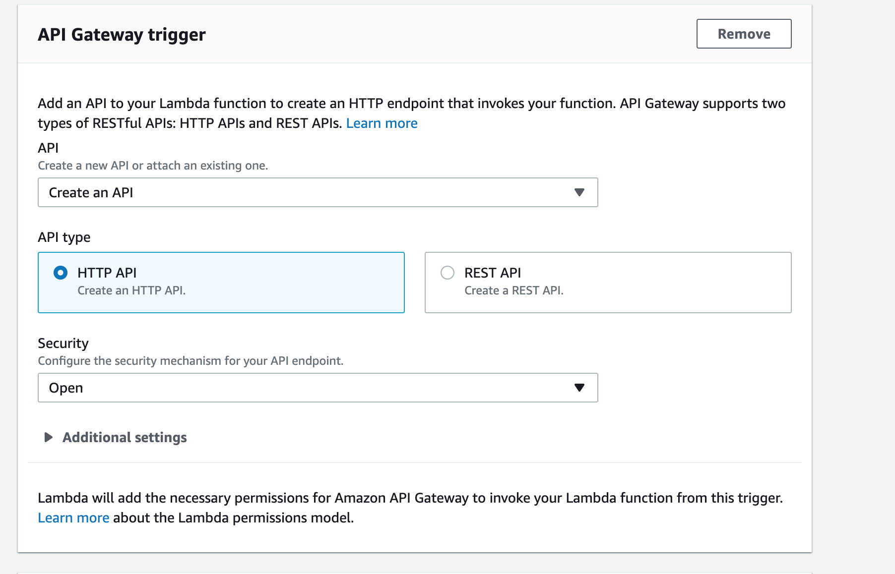
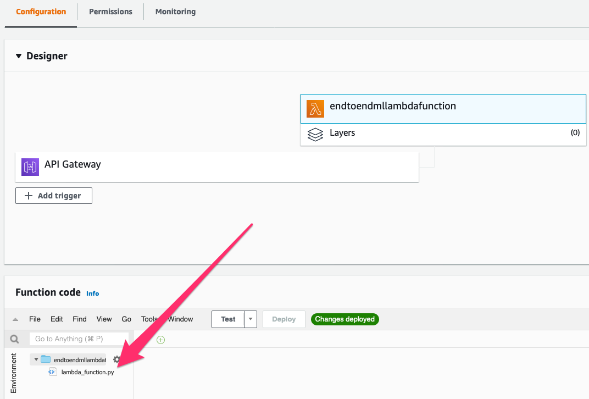
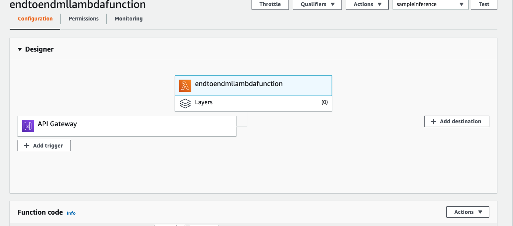
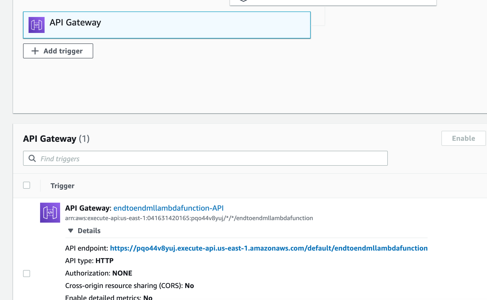

# Build a REST API with Amazon API Gateway and AWS Lambda

Once we have trained our model and deployed to an Amazon SageMaker fully-managed endpoint, we are ready to build a REST API that will be invoked by client applications to get inferences.
Although the Amazon SageMaker HTTPs endpoint might be called directly, using Amazon API Gateway for our REST API provides more control on things like user authorization, usage profiles, throttling, API versioning, etc. 

The request flow would be:

1. The client application executes a POST request to the Amazon API Gateway endpoint
2. An AWS Lambda function processes the request and calls the Amazon SageMaker HTTPs endpoint where our model is hosted
3. The inference response is returned by the Amazon SageMaker endpoint and sent back to the client via Amazon API Gateway

Let's get started by creating our rest API.

## Create AWS Lambda function and Amazon API Gateway HTTP API

1. Open your **AWS Console** and open **Lambda**
2. In the **Functions** section, click on **Create function**
3. Select **Use a blueprint** and search for **microservice-http-endpoint-python**. Select it and click **Configure**



4. Type **endtoendmllambdafunction** in the function name textbox. Select _Use an existing role_ and then choose the IAM role **_LambdaInvokeSageMakerEndpointRole-endtoendml_** from the **Existing Role** dropdown. This will allow the function to invoke the Amazon SageMaker endpoint.



5. In the section **API Gateway trigger** choose **Create an API** and select **HTTP API**. From the **Security** dropdown choose **Open**. Then click **Create function**



6. You are now redirected to the Lambda function page. In the **Function code** section, double click "lambda_function.py":



and replace the existing code with with the following snippet, making sure that the indentation is matching:

> ⚠️ **Warning**: the **ENDPOINT_NAME** variable must be set to the name of the endpoint that was deployed in the previus module of this workshop.

```
import boto3
import json
import csv
import os

# Remember to update the endpoint name with the name of the SageMaker endpoint
ENDPOINT_NAME = 'end-to-end-ml-sm-pipeline-endpoint-XXXXXXXXXX'
runtime= boto3.client('runtime.sagemaker')

def build_response(status_code, response_body):
    print(status_code)
    print(response_body)
    return {
                'statusCode': status_code,
                #'body': json.dumps(response_body),
                'body': str(response_body['predictions'][0]['score']),
                'headers': {
                    'Content-Type': 'application/json',
                    'Access-Control-Allow-Origin' : '*',
                    'Access-Control-Allow-Credentials' : 'true',
		            'Access-Control-Allow-Headers': '*'
                },
            }

def lambda_handler(event, context):
    print("Received event: " + json.dumps(event, indent=2))
    
    if 'requestContext' in event:
        if event['requestContext']['http']['method'] == 'OPTIONS':
            return build_response(200, '')

        elif event['requestContext']['http']['method'] == 'POST':
            turbine_data = event['body']
            
            response = runtime.invoke_endpoint(EndpointName=ENDPOINT_NAME,
                                               ContentType='text/csv',
                                               Body=turbine_data)
            print(response)
            result = json.loads(response['Body'].read().decode())
            print(result)
            return build_response(200, result)
    
        else:
            return build_response(405, 'null')

```


The implementation is straightforward: the Lambda handler can manage both OPTIONS and POST requests, and when a POST is executed, the Amazon SageMaker endpoint is invoked with the _Body_ parameter set to the request body. Then, the response is returned to the caller.

7. Click **Deploy** to save changes.
8. In the **Designer** section, click on **API Gateway** and then expand **Details**. Copy the _API endpoint_





### Invoke the API from an Angular single-page application
You can now proceed to <a href="../06_invoke_API/">Module 06</a> to invoke the API Gateway endpoint from an Angular single-page application.
