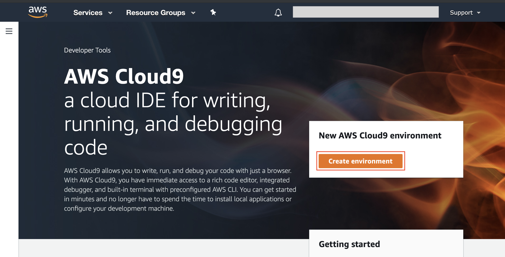
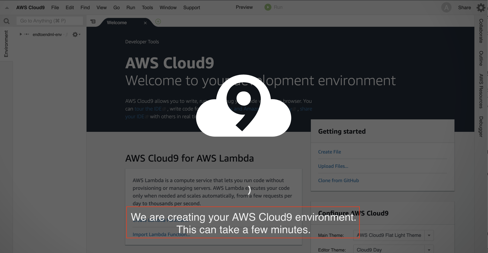
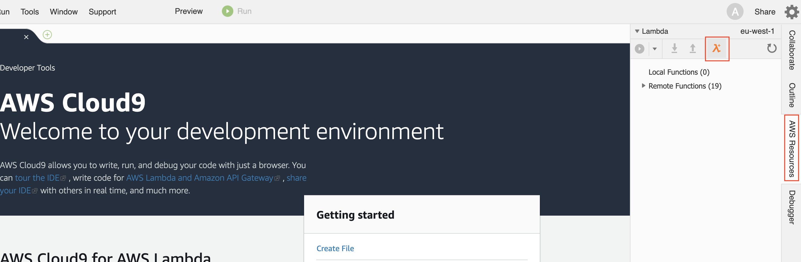
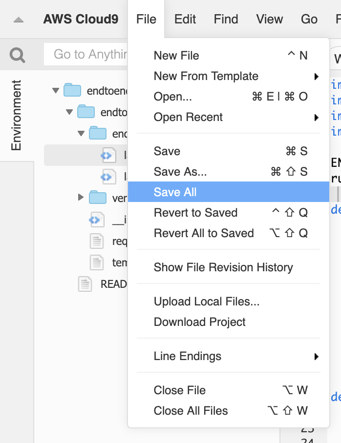
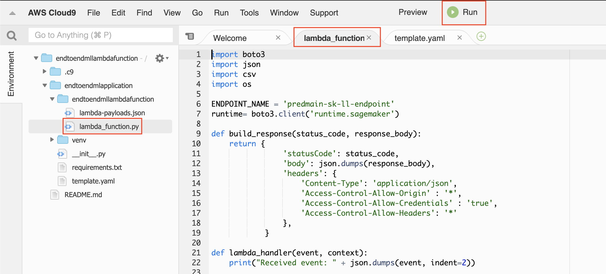
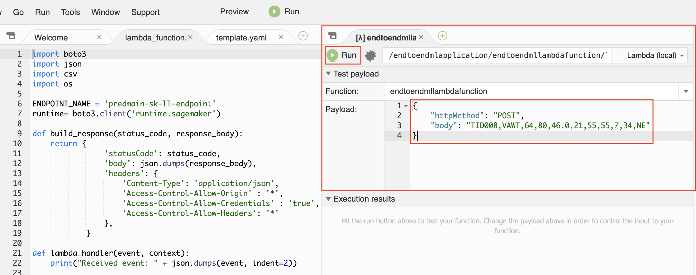
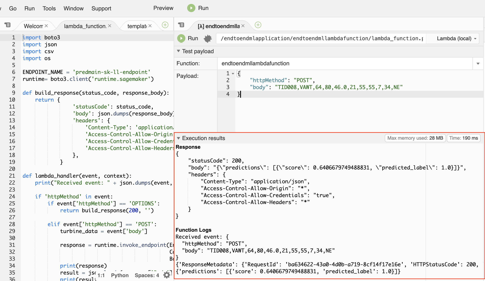
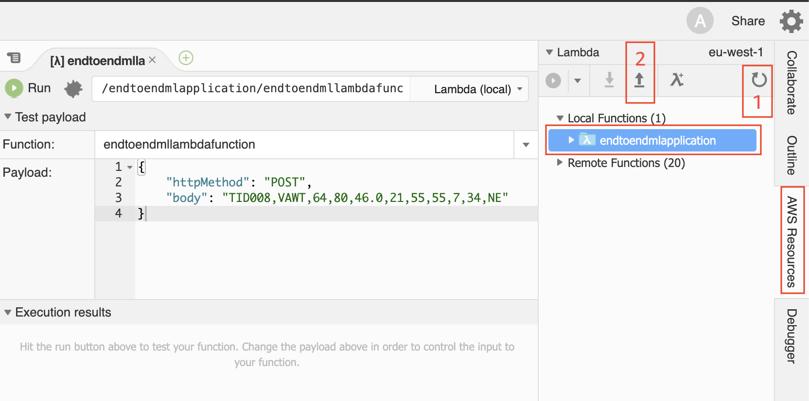
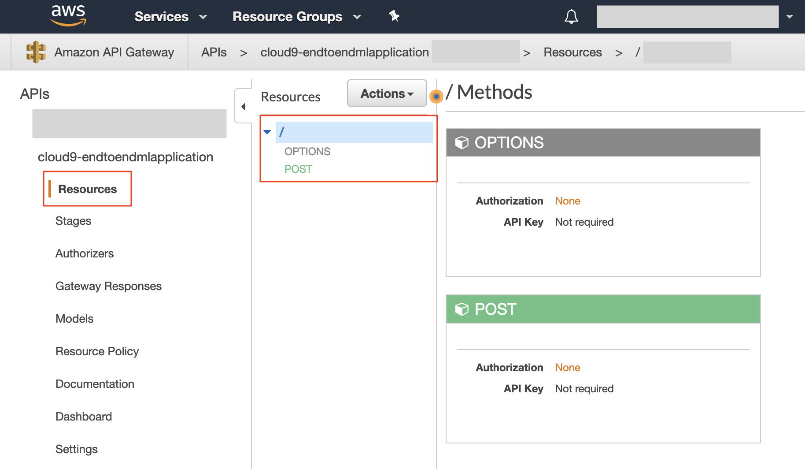
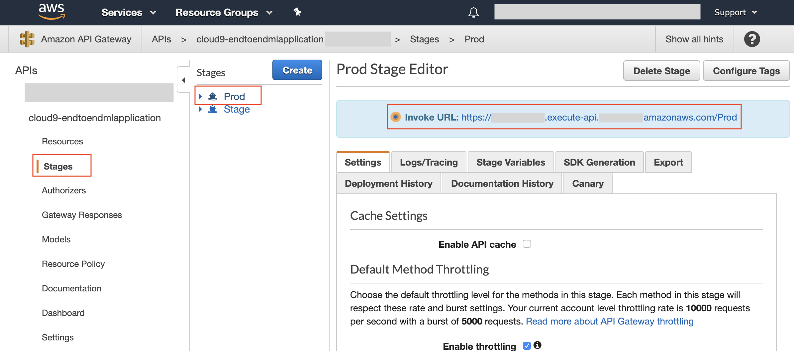

// Copyright Amazon.com, Inc. or its affiliates. All Rights Reserved. // SPDX-License-Identifier: CC-BY-SA-4.0

# Build a REST API with Amazon API Gateway and AWS Lambda

Once we have trained our model and deployed to an Amazon SageMaker fully-managed endpoint, we are ready to build a REST API that will be invoked by client applications to get inferences.
Although the Amazon SageMaker HTTPs endpoint might be called directly, using Amazon API Gateway for our REST API provides more control on things like user authorization, usage profiles, throttling, API versioning, etc. 

The request flow would be:

1. The client application executes a POST request to the Amazon API Gateway endpoint
2. An AWS Lambda function processes the request and calls the Amazon SageMaker HTTPs endpoint where our model is hosted
3. The inference response is returned by the Amazon SageMaker endpoint and sent back to the client via Amazon API Gateway

Let's get started by creating our rest API.

## Create AWS Lambda function and Amazon API Gateway REST API

We are going to use AWS Cloud9 for building our API: AWS Cloud9 is a cloud-based integrated development environment (IDE) that lets you write, run, and debug your code with just a browser. The service preconfigures the development environment with all the SDKs, libraries, and plug-ins needed for serverless development, thus facilitating the development of AWS Lambda functions and API Gateway APIs.

1. Open your **AWS Console** and open **Cloud9**
2. Click on **Create environment**
	
	

3. Add a name **endtoendml-env**, click on **Next step**
4. Leave the configuration with the default settings and click on **Next step**
5. Click **Create environment**

	Now that we have created our Cloud9 environment we will be waiting a couple of minutes for the environment to be up and running and in front of us.

	

Once the environment is up and running please:

1. Press on **AWS Resources** on the right side of the screen
2. Click on the **Lambda icon** to create a new function as it is shown on the picture below.

	

3. Type **endtoendmllambdafunction** in the function name textbox and **endtoendmlapplication** in the application name textbox and click **Next**.
4. Select **Python3.6** in runtime. Then chose **empty-python** and click **Next**.
5. In Function trigger, leave none and click **Next**.
6. In the **Create serverless application** window, select _Choose existing role_ from the **Role** dropdown and then choose the IAM role **_LambdaInvokeSageMakerEndpointRole-endtoendml_** from the **Existing Role** dropdown. This will allow the function to invoke the Amazon SageMaker endpoint. Then press **Next**.
	
	> The **LambdaInvokeSageMakerEndpointRole-endtoendml** IAM role has been created in advance in your AWS account for the purpose of this workshop.
7. Press **Finish**.
8. Once clicked on **Finish** you _might_ get a pop up window asking for **Drag & drop files here**, in this case, please ignore it by click on **x** on the top right corner of the popup window.

Now that we have created our Lambda function, we need to add the code to it. The files that we are going to edit are _lambda\_function.py_ and _template.yaml_ that you can open using the file browser in the left side of the Cloud9 editor.


### Edit _lambda\_function.py_

The file _lambda\_function.py_ will contain the code that will process the content of the HTTP request of the API call and invoke the Amazon SageMaker endpoint.

Please **replace** the content of that file with the following snippet, making sure that the indentation is matching:

> ⚠️ **Warning**: the **ENDPOINT_NAME** variable must be set to the name of the endpoint that was deployed in the previus module of this workshop.

```
import boto3
import json
import csv
import os

# Remember to update the endpoint name with the name of the SageMaker endpoint
ENDPOINT_NAME = 'pred-main-pipeline-endpoint-XXXXXXXXXX'
runtime= boto3.client('runtime.sagemaker')

def build_response(status_code, response_body):
    return {
                'statusCode': status_code,
                'body': json.dumps(response_body),
                'headers': {
                    'Content-Type': 'application/json',
                    'Access-Control-Allow-Origin' : '*',
                    'Access-Control-Allow-Credentials' : 'true',
		            'Access-Control-Allow-Headers': '*'
                },
            }

def lambda_handler(event, context):
    print("Received event: " + json.dumps(event, indent=2))
    
    if 'httpMethod' in event:
        if event['httpMethod'] == 'OPTIONS':
            return build_response(200, '')

        elif event['httpMethod'] == 'POST':
            turbine_data = event['body']
            
            response = runtime.invoke_endpoint(EndpointName=ENDPOINT_NAME,
                                               ContentType='text/csv',
                                               Body=turbine_data)
            print(response)
            result = json.loads(response['Body'].read().decode())
            print(result)
            return build_response(200, result)
    
        else:
            return build_response(405, 'null')

```
The implementation is straightforward: the Lambda handler can manage both OPTIONS and POST requests, and when a POST is executed, the Amazon SageMaker endpoint is invoked with the _Body_ parameter set to the request body. Then, the response is returned to the caller.

### Edit _template.yaml_
The file _template.yaml_ contains a template - defined through the **Serverless Application Model** - to deploy the AWS Lambda function. We are going to add a few instructions to deploy also an Amazon API Gateway API.

Please **add** the following lines to the _template.yaml_ file, after the _CodeUri_ property, making sure that the _Events_ property indentation is matching the indentation of _CodeUri_:

```
      Events:
        GetInference:
          Type: Api
          Properties:
            Path: /
            Method: POST
        OptionsInference:
          Type: Api
          Properties:
            Path: /
            Method: OPTIONS
```
The additional statements are used to deploy an Amazon API Gateway REST API, which will accept POST and OPTIONS requests and pass the request content to the AWS Lambda function defined above.

For additional information on this way of integrating AWS Lambda and Amazon API Gateway, please visit <a href="https://docs.aws.amazon.com/apigateway/latest/developerguide/set-up-lambda-proxy-integrations.html">**AWS Lambda Proxy Integration**</a>.  

### Save all changes
After you have finished editing _lambda\_function.py_ and _template.yaml_, you have to save all changes by using the menu item **File > Save All**.



### Test locally

Before deploying our Lambda function, it is a good practice to test it locally in the AWS Cloud9 environment. To accomplish this task:

1. Ensure the _lambda__function.py_ file is opened and is the active tab, then press the **Run** button in the top-central area of the screen as shown in the following screenshot:

	

2. A new tab will appear, where you can type the payload that will be passed to the function and execute it.

	

3. Input the following payload and press **Run** to test the function locally.
	
	```
	{
    	"httpMethod": "POST",
    	"body": "TID008,VAWT,64,80,46.0,21,55,55,7,34,NE"
	}
	```

4. You should see some output as shown in the following screenshot:

	
 

### Deploy function and API

Now we are ready to deploy our AWS Lambda function and Amazon API Gateway API. Please execute the following actions:

1. In the right-side panel make sure **AWS Resources** is selected.
2. Then, in the panel tree browser select the package **endtoendmlapplication**.
3. Press in sequence the **Refresh functions list** and then the **Deploy the selected Lambda function** buttons as shown in the following screenshot:

	
4. After a while, the deploy completes and you should not see any error message.

### Verify API Gateway deployment

After our Lambda function and API have been deployed from Cloud9, we can verify the API Gateway deployment in order to get the address of our REST endpoint.

1. Go back to the **AWS Console** and access **API Gateway** (you can use the top search bar for finding the service).
2. In the dashboard, click on the widget **cloud9-endtoendmlapplication**. A screen showing the API resources and the defined HTTP methods will appear, similar to the one shown below:

	

3. Click on **Stages** in the left tree menu and then on the **Prod** stage. Copy/take note of the **Invoke URL** that will be used by the client application as API endpoint.

	
4. At your convenience, you can also browse through the different settings that can be specified for the stage, like log and tracing, throttling, caching, etc.

### Invoke the API from an Angular single-page application
You can now proceed to <a href="../06_invoke_API/">Module 06</a> to invoke the API Gateway endpoint from an Angular single-page application.