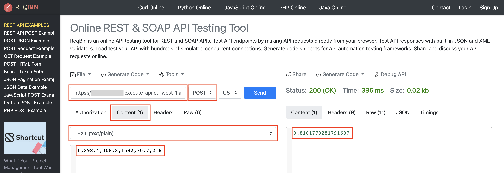

# Module 7: Invoke the HTTP API from the browser

> ⚠️ This module does not have a Jupyter notebook. 

To perform inference, you will use a web tool called **ReqBin** to send requests to new HTTP API. 

- Access ReqBin at https://reqbin.com/
- Configure the client as shown in the following screenshot:

    

Make sure you:
- Provide the address of the Amazon API Gateway API you deployed in the previous step.
- Set the method to POST
- Set the content type to text/plain
- Add an inference record as content. Example: 

```L, 298.4, 308.2, 1582, 70.7, 216```

Then, click on **Send** to execute the request and get the inference result.

## You have completed module 5 and the workshop

Well done!

We hope you have enjoyed the journey. In this workshop, you followed an experimentation process in SageMaker Studio in a JupyterLab space and built and trained a model. You then SageMaker Studio's Code Editor, which is based on Code-OSS (Visual Studio Code – Open Source), to deploy the model into an endpoint. You then built a pipeline to automate the end to end process, and created an HTTP API that allows web clients to perform predictions.

Please feel free to contiunue exploring SageMaker Studio environment and reading the notes in the notebooks you might have skipped when going through the workshop.

## Clean up
### AWS-run event using AWS Workshop Studio
AWS Workshop Studio performs the clean up after the event, so you don't need to clean up the resources.

### Self-paced using your AWS account
Follow the clean up steps to avoid incurring charges.

