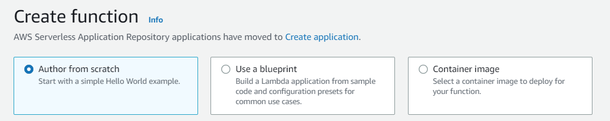
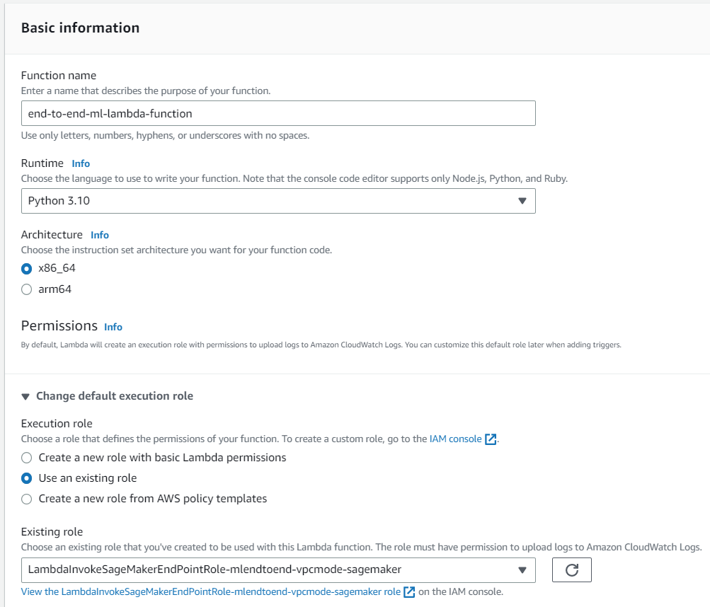
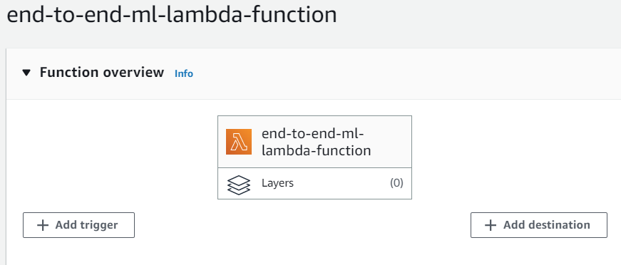
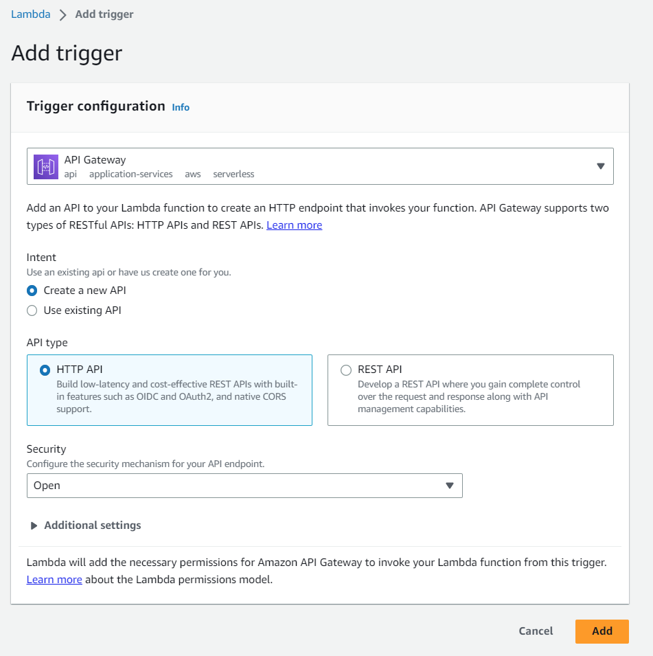
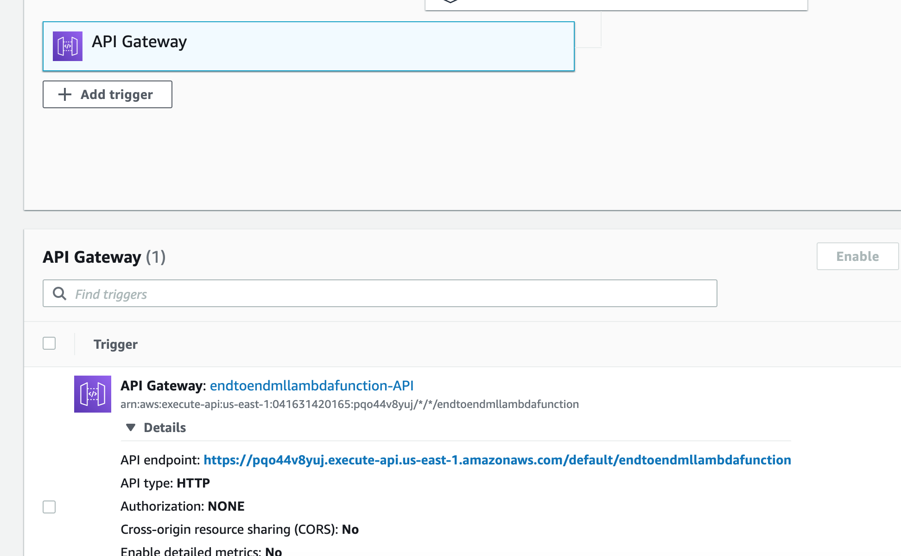
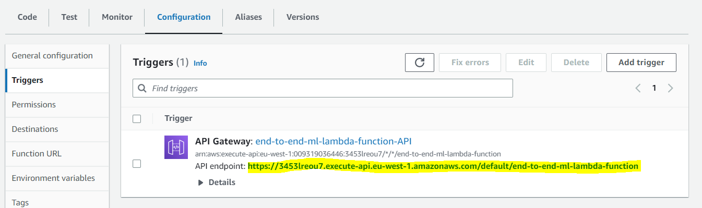

# Build a REST API with Amazon API Gateway and AWS Lambda

After training the model and deploying it to a fully-managed Amazon SageMaker endpoint, you are ready to build a HTTP API that will be invoked by client applications to get inferences.
Although you can call the Amazon SageMaker HTTPs endpoint directly, creating an HTTP API in Amazon API Gateway provides more control on user authorization, usage profiles, throttling, API versioning, etc. 

After building the API, the request flow would be as follows:

1. The client application send a HTTP POST request to the Amazon API Gateway endpoint.
2. An AWS Lambda function processes the request and calls the Amazon SageMaker HTTPS endpoint where the model is hosted
3. Lambda function receives the inference response from Amazon SageMaker endpoint and send it back to the client via Amazon API Gateway

Let's start building the HTTP API.

## Create AWS Lambda function and Amazon API Gateway HTTP API

1. Open **AWS Console** and go to the **Lambda** service.
2. In the **Functions** section, click on **Create function**.
3. Select **Author from scratch**.



4. Type **end-to-end-ml-lambda-function** in the function name textbox. Select _Use an existing role_ and then choose the IAM role **_LambdaInvokeSageMakerEndpointRole-endtoendml_** from the **Existing Role** dropdown. This will allow the function to invoke the Amazon SageMaker endpoint.



5. In **Function overview**, choose **Add trigger** and select **API Gateway** as the source.



6. Choose **Create a new API** and keep the API Type as **HTTP API**. In the **Security** section, choose **Open**, then choose **Add**.



7. You are now redirected to the Lambda function page. In the **Function code** section, double click "lambda_function.py":



8. Replace the existing code with with the following snippet, making sure that the indentation is matching:

> ⚠️ **Warning**: the **ENDPOINT_NAME** variable must be set to the name of the endpoint that was deployed in the previus module of this workshop.

```
import boto3
import json
import csv
import os

# Remember to update the endpoint name with the name of the SageMaker endpoint
ENDPOINT_NAME = 'end-to-end-ml-sm-pipeline-endpoint-XXXXXXXXXX'
runtime= boto3.client('runtime.sagemaker')

def build_response(status_code, response_body):
    print(status_code)
    print(response_body)
    return {
                'statusCode': status_code,
                #'body': json.dumps(response_body),
                'body': str(response_body['predictions'][0]['score']),
                'headers': {
                    'Content-Type': 'application/json',
                    'Access-Control-Allow-Origin' : '*',
                    'Access-Control-Allow-Credentials' : 'true',
		            'Access-Control-Allow-Headers': '*'
                },
            }

def lambda_handler(event, context):
    print("Received event: " + json.dumps(event, indent=2))
    
    if 'requestContext' in event:
        if event['httpMethod'] == 'OPTIONS':
            return build_response(200, '')

        elif event['httpMethod'] == 'POST':
            turbine_data = event['body']
            
            response = runtime.invoke_endpoint(EndpointName=ENDPOINT_NAME,
                                               ContentType='text/csv',
                                               Body=turbine_data)
            print(response)
            result = json.loads(response['Body'].read().decode())
            print(result)
            return build_response(200, result)
    
        else:
            return build_response(405, 'null')

```

The implementation is straightforward: the Lambda handler responds to OPTIONS and POST requests. When it receives a POST request, it invokes the Amazon SageMaker endpoint with the _Body_ parameter set to the request body, and when it receives the inference results, it sends the response to the caller.

9. Click **Deploy** to save changes.
10. Back in the **Function overview** section at the top, click on the **API Gateway** trigger and from the **Configuration** tab, make a note of _API endpoint_. You will need this in the next module.




### Invoke the API from a web page
You can now proceed to <a href="../07_invoke_API/">Module 07</a> to invoke the API Gateway endpoint from a web client application.
