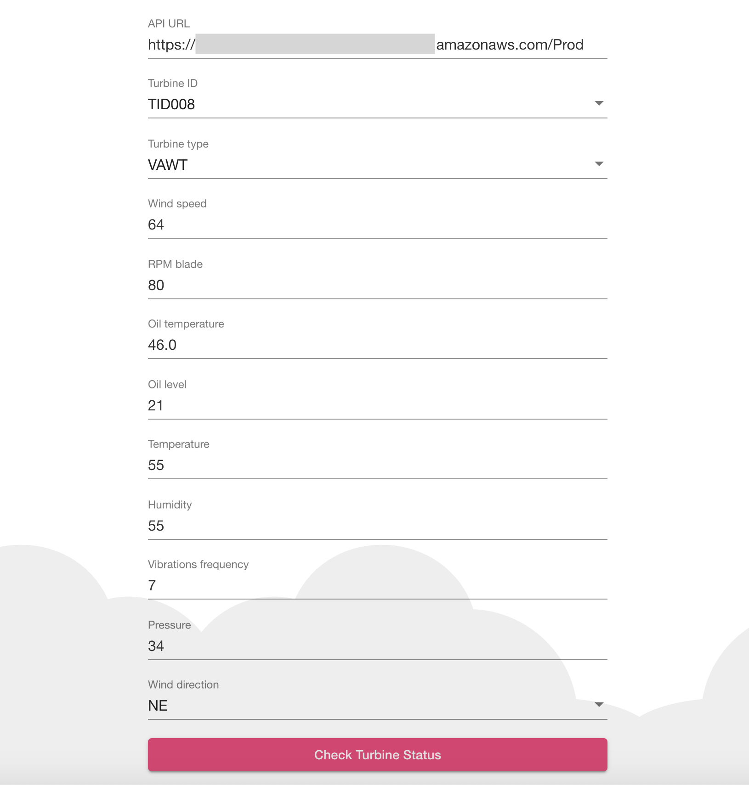
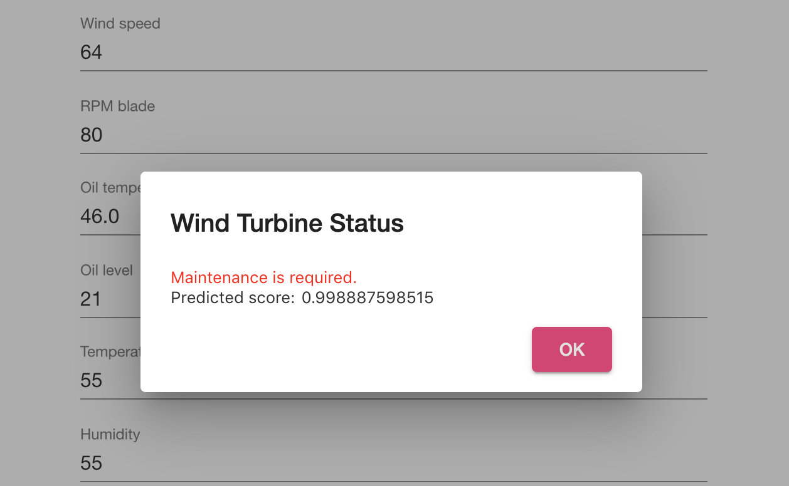

# Invoke the API from a client application

For the purpose of executing inferences from a client application we have built an Angular single-page application and hosted it on Amazon S3.

> **Note**: we will not go through the steps of building the Angular single-page application and hosting it on Amazon S3 since this is out of scope with respect to the workshop objectives. For additional information on Amazon S3 static website hosting please check the Amazon S3 documentation at the following address: <a href="https://docs.aws.amazon.com/AmazonS3/latest/dev/WebsiteHosting.html">https://docs.aws.amazon.com/AmazonS3/latest/dev/WebsiteHosting.html</a>.

You can access the application using this link:
<a href="http://endtoendmlapp.cloud-oriented.com/">endtoendmlapp.cloud-oriented.com</a>

The application is a simple web page where you can input the address of the Amazon API Gateway API deployed in the previous step, plus the values for the wind turbine plant sensors, and check if the plant requires maintenance or its status is healthy.

For example, with the following inputs we obtain that maintenance is required with a very high predicted score.

<h2>Well done!</h2>

By executing this step you have completed the module and the workshop.
 
We hope you enjoyed it and we are happy to help addressing any doubt/question!

