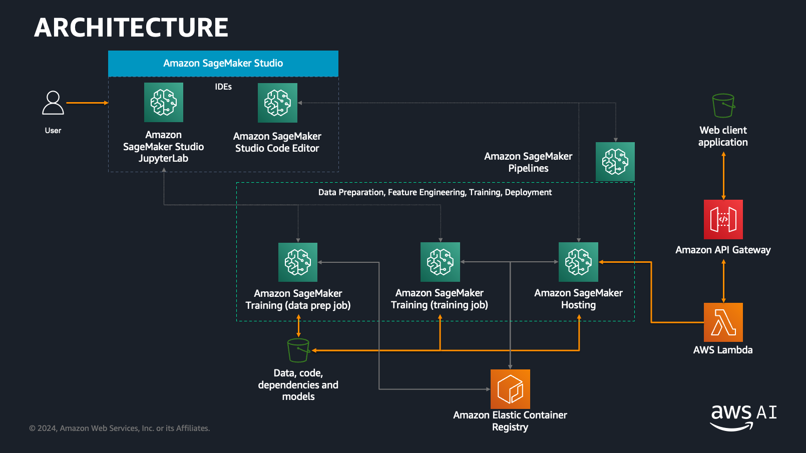

# End to end Machine Learning with Amazon SageMaker

## Introduction

The Machine Learning process is an iterative process that consists of several steps:

- Identifying a business problem and the related Machine Learning problem
- Data ingestion, integration and preparation
- Data visualization and analysis, feature engineering, model training and model evaluation
- Model deployment, model monitoring and debugging

The previous steps are generally repeated multiple times to better meet business goals following to changes in the source data, decrease in the perfomance of the model, etc.

The process can be represented with the following diagram:

After a model has been deployed, we might want to integrate it with our own application to provide insights to end users.

In this workshop, we will go through the steps required to build a fully-fledged machine learning application on AWS. We will execute an iteration of the Machine Learning process to build, train and deploy a model using Amazon SageMaker, and then we will deploy a REST inference API with Amazon API Gateway to execute inferences from a web client. Finally we will cover automation of the ML workflow.

The final architecture will be:

## The Machine Learning task

We are going to use the <a href="https://archive.ics.uci.edu/ml/datasets/AI4I+2020+Predictive+Maintenance+Dataset">AI4I 2020 Predictive Maintenance Dataset</a> from the UCI Machine Learning Repository. It is a synthetic dataset that reflects real predictive maintenance data encountered in industry.

The dataset consists of 10000 records and 14 features, representing some measurements that have been collected on the machinery, plus the indication of failure, if any.

> ⚠️ **Note**: This is a basic dataset that oversimplifies the Predictive Maintenance task. However, it keeps this workshop easy to follow while while being a good representative of the various steps of the ML workflow.

Our goal is to buildi a simple Machine Learning model that will predict whether a piece of machinery is going to fail (<b>Predictive Maintenance</b>).

Following is an excerpt from the dataset:

|UDI|Product ID|Type|Air temperature [K]|Process temperature [K]|...|Machine failure|
|-------|-------|-------|-------|-------|-------|-------|
|1|M14860|M|298.1|308.6|...|0|
|2|L47181|L|298.2|308.7|...|0|
|3|L47182|L|298.1|308.5|...|0|
|51|L47230|L|298.9|309.1|...|1|

The target variable is the **Machine failure** attribute, which is binary and suggests implementing a binary classification model.

After building the model, we will host it and expose as a REST API that will respond to inference requests from client applications.

## Modules

This workshops consists of seven modules:

- <a href="01_configure_sagemaker_studio/">**Module 01**</a> - Open Amazon SageMaker Studio and clone the repository.
- <a href="02_data_exploration/">**Module 02**</a> - Use Amazon SageMaker Studio Notebooks and standard Python libraries to execute data exploration.
- <a href="03_feature_engineering/">**Module 03**</a> - Perform data preprocessing and feature engineering using Amazon SageMaker Processing and SKLearn.
- <a href="04_train_model/">**Module 04**</a> - Train a binary classification model with the Amazon SageMaker open-source XGBoost container; the model will predict whether the machinery is going to fail. [Optional] Use Sagemaker Debugger to monitor training progress with rules and visualize training metrics like accuracy and feature importance.
- <a href="05_deploy_model/">**Module 05**</a> - Deploy the feature engineering and ML models as a pipeline using Amazon SageMaker hosting (inference pipelines). [Optional] Use Sagemaker Model Monitor to track data drift violations against the training data baseline.
- <a href="06_API_Gateway_and_Lambda/">**Module 06**</a> - Build a REST API using Amazon API Gateway create an AWS Lambda function that invokes the Amazon SageMaker endpoint for inference.
- <a href="07_invoke_API/">**Module 07**</a> - Use a web client to invoke the REST API and get inferences.
- <a href="08_workflow/">**Module 08**</a> - Use Amazon SageMaker Pipelines to orchestrate the model build workflow and store models in model registry.

You must comply with the order of modules, since the outputs of a module are inputs of the following one.

## Getting started

We have designed this workshop assuming that each participant is using an AWS account provided and pre-configured by the workshop instructor(s). However, you can also choose to use your own AWS account, but you'll have to execute some preliminary configuration steps as described <a href="setup/">here</a>.

Once you are ready to go, please start with <a href="01_configure_sagemaker_studio/">**Module 01**</a>.

## License

The contents of this workshop are licensed under the [Apache 2.0 License](./LICENSE).

## Acknowledgements

Dua, D. and Graff, C. (2019). UCI Machine Learning Repository [http://archive.ics.uci.edu/ml]. Irvine, CA: University of California, School of Information and Computer Science.

## Authors

[Giuseppe A. Porcelli](https://it.linkedin.com/in/giuporcelli) - Principal ML Specialist Solutions Architect - Amazon Web Services EMEA 
[Antonio Duma](https://it.linkedin.com/in/antoniod82) - Senior Startup Solutions Architect - Amazon Web Services EMEA  
[Hasan Poonawala](https://www.linkedin.com/in/hasanp) - Senior ML Specialist Solutions Architect - Amazon Web Services EMEA  
[Mehran Nikoo](https://www.linkedin.com/in/mnikoo/) - Senior Digital Native Business Solutions Architect - Amazon Web Services EMEA  