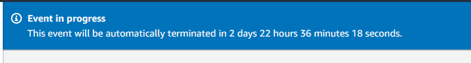

# Module 0 - Access the AWS Console

In this module, you will access AWS Console and choose the AWS region.

## Access the AWS Console

### AWS-run event using AWS Workshop Studio
If you're running this workshop as part of an AWS-run event, AWS Workshop Studio will provision temporary accounts and create all resources you need to complete the workshop.

1. Browse to [**AWS Workshop Studio**](https://catalog.us-east-1.prod.workshops.aws/), and click **Get Started**. Alternatively, use the direct URL provided by your facilitator to access the event.

2. Select **Email one-time password (OTP)**, then enter your email address. Your facilitator should have whitelisted your email address and/or email domain to allow access to the event. Click **Send passcode**.

	

3. When you receive the email, copy the passcode into the text box, and click **Sign In**.

	

4. If you've been provided with a direct URL, you can skip this step. Otherwise, enter the event code provided by your facilitator.

	

5. Review the Terms and Conditions, mark the checkbox next to I agree... and click Join event

	

6. You'll see the steps for the workshop on the left. To access your AWS account, click **Open AWS console** in the bottom left hand corner. You may want to copy this sign-in url and open the console in a new window or browser.

	

You should now have access to your temporary AWS account. Note that this is a temporary account and will be cleaned up when the event is terminated. In AWS Workshop Studio, you should see a notice with the time remaining for the account.

	

### Choose the right AWS Region

Check with the workshop facilitator to find the right region to use. Then, in the upper-right corner of the AWS Management Console, make sure you are in the right region.

### Self-paced using your AWS account
Open the [AWS Console](https://console.aws.amazon.com/) in a new window and choose a region you want to run the workshop in. We have tested this workshop in the following regions, but the workshop should work in the regions where Amazon SageMaker is available. Check whether the intended region in the list on the [Amazon SageMaker Pricing page](https://aws.amazon.com/sagemaker/pricing/) under the **On-Demand Pricing** section.

|Region Name          |Region   |
|---------------------|---------|
|US East (N. Virginia)|us-east-1|
|US West (Oregon)     |us-west-2|
|Europe (Ireland)     |eu-west-1|

## You have completed module 0
Proceed to [README.md in module 1](../01_configure_sagemaker_studio/README.md) to configure Amazon SageMaker Studio for the workshop.
