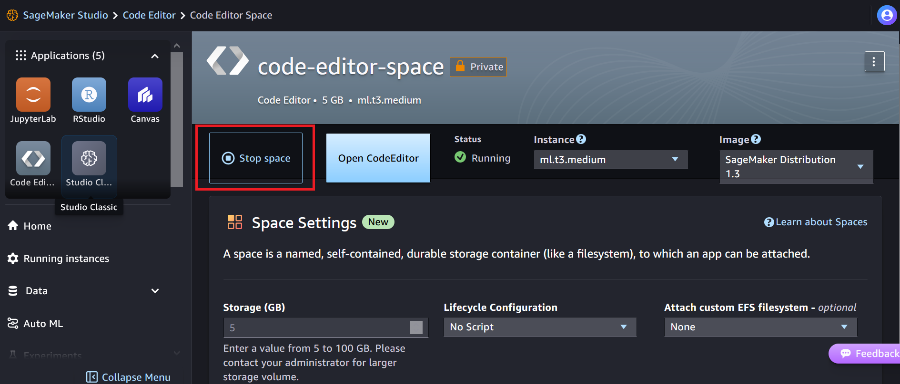

To make sure you do not incur additional charges after you complete the workshop, follow these steps to remove the resources you created. If you created any other resources, you should remove them separately.

1. Make note of the Amazon Resource Name (ARN) for the SageMaker Studio domain. You will need the ARN in step 3.   
    - Go to the CloudFormation console, select the last stack you created (named _endtoendml-workshop-domain_ if you used the suggested name during the setup phase). 
    - Go to the Output tab and make a note of the `StudioDomainArn`. You will need this value later.

2. Follow the steps in [SageMaker inference endpoint and resources via the AWS console](https://docs.aws.amazon.com/sagemaker/latest/dg/realtime-endpoints-delete-resources.html) to delete the inference endpoint and related resources..

3. Throughout the workshop, you created two SageMaker app spaces, so you should delete them manually. 

    3.1. Click on the highlighted area to open the JupyterLab app space you created.
        

    In order to delete the app we first need to stop it:

    

    Once it is stopped, click on the highlighted area to delete the app. 

    

    3.2. Click on the highlighted area to open the Code Editor app space you created.

    

    Stop the app. 

    

    Once it is stopped, click on the highlighted area to delete the app. 

    

4. Delete the SageMaker Studio and associated resources:
    - Go to the CloudFormation console.
    - Locate the second stack you created (_endtoendml-workshop-domain_ if you used the suggested name during the setup phase) and delete the stack.
    - When the stack is deleted, move to the next step.

5. Delete the resources that were automatically created when you created the SageMaker Studio domain, including the mount points and security groups for the EFS volume.

    Perform the following steps on your local machine. Make sure you have set AWS credentials and profile in the your shell environment.

    Make sure the dependencies are installed.

    `python3 -m pip install --user -r requirements.txt`

    Run `cleanup-efs.py`, passing in the the ARN of the SageMaker Studio domain as an argument:

    ```
    python3 cleanup.py --sagemaker-studio-domain [ARN for the SageMaker Studio domain from step 1]
    ```

    To prevent accidental data loss, the script does not delete the volume, so you should delete the volume yourself once you have made sure you do not need any data or code you might have created in SageMaker Studio. The script writes the File System ID for the EFS volume to the output. Make a note of the file system ID as you will need it in step 7.

6. You can now delete the VPC and its associated resources such as VPC endpoints and subnets. In the CloudFormation console, locate the first stack you created (_named endtoendml-workshop-networking_ if you used the suggested name) and delete it. If the stack fails to delete after a while, make sure you have completed step 5.

7. Once you have made sure you do not need the data in the EFS volume, go to the EFS console, locate the EFS volume using the file system ID you noted earlier, and delete it.