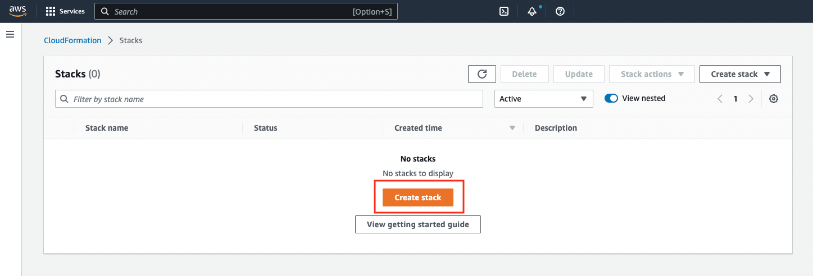
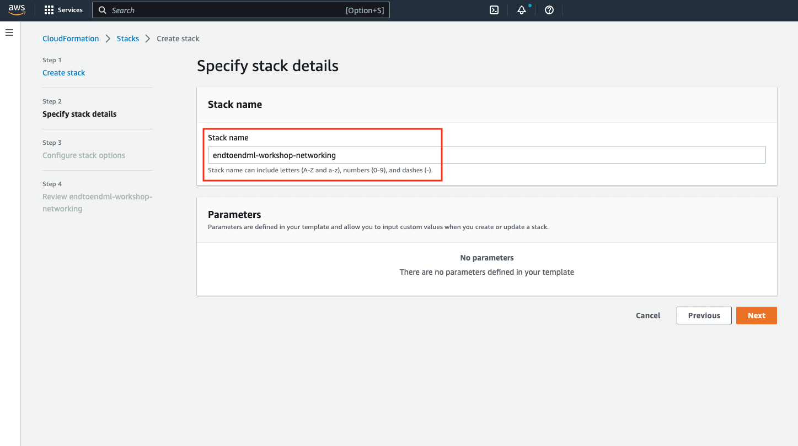
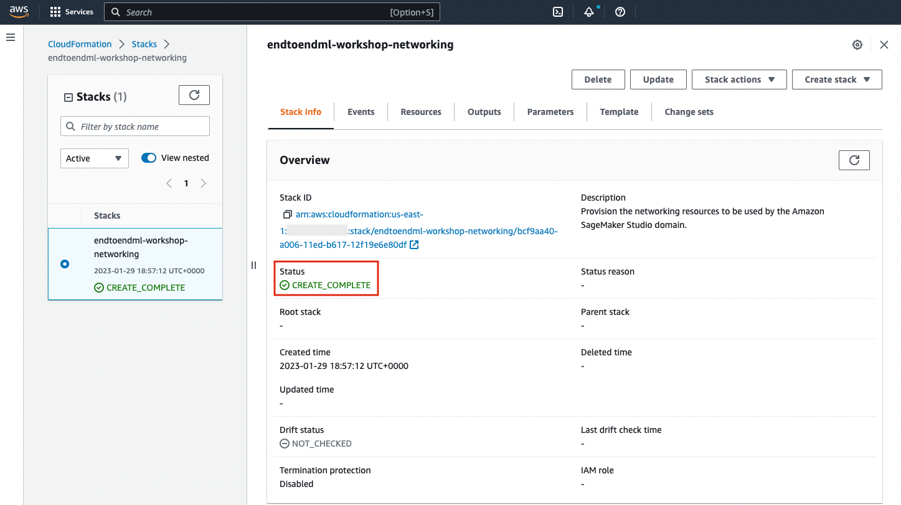
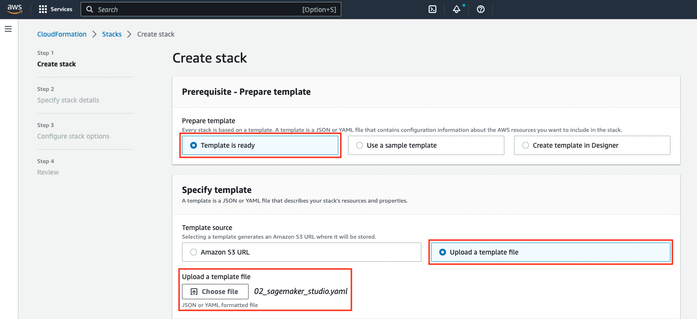
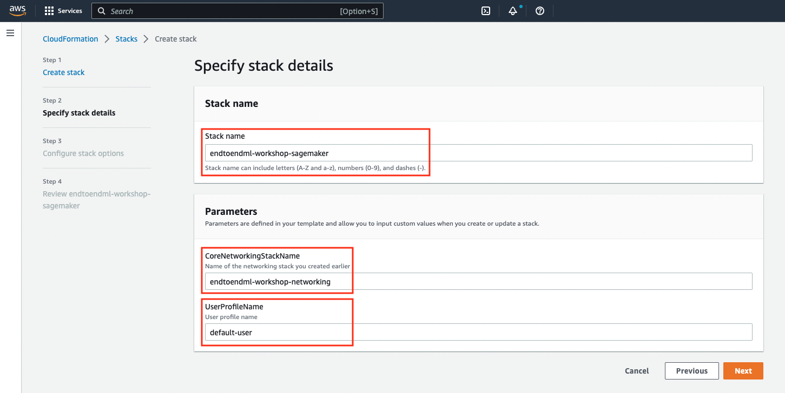
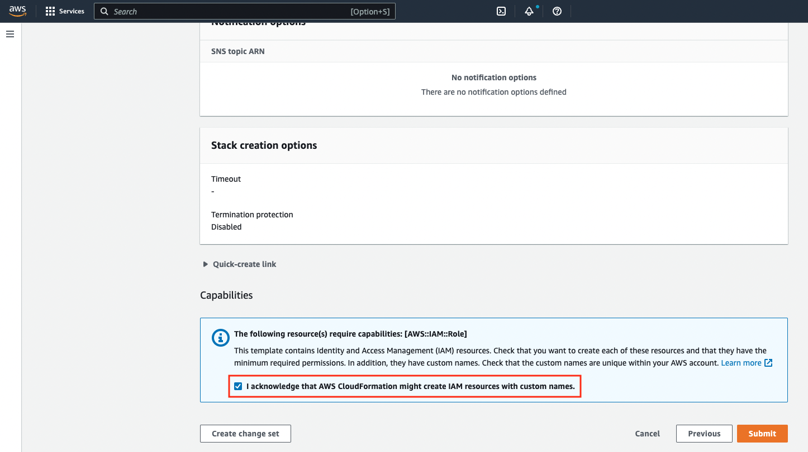
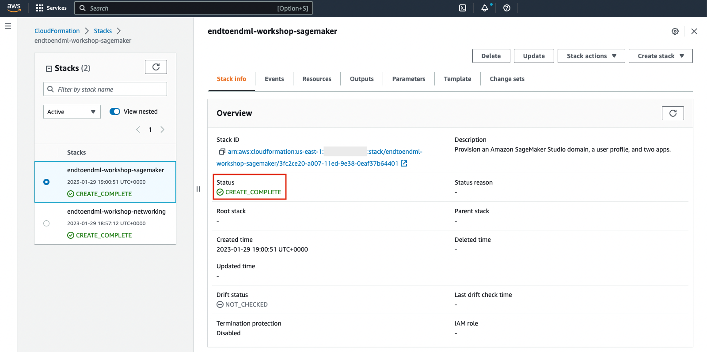

# Setup your AWS Account

> ⚠️ **Running this workshop in your AWS account will incur costs**. You will need to delete the resources you create to avoid incurring further costs after you have completed the workshop. Follow the [clean up steps](cleanup/README.md).

## AWS Event using AWS Workshop Studio
The environment is already set up for you. Proceed to <a href="../01_configure_sagemaker_studio/README.md">**Module 01**</a>.

## Self-paced using your AWS account

> :warning: **Run this workshop in sandbox/playground AWS accounts only**. This workshop is meant to be used in sandbox/playground environments only. Do not deploy the resources or grant permissions described below in controlled or production environments.

If you are using your own AWS Account, the IAM user/role you are using to provision the resources should have the following permissions in the sandbox AWS account you are using for the workshop:
```
      - "arn:aws:iam::aws:policy/ReadOnlyAccess"
      - "arn:aws:iam::aws:policy/AWSLambda_FullAccess"
      - "arn:aws:iam::aws:policy/AmazonSageMakerFullAccess"
      - "arn:aws:iam::aws:policy/AmazonAPIGatewayAdministrator"
      - "arn:aws:iam::aws:policy/AmazonS3FullAccess"
      - "arn:aws:iam::aws:policy/CloudWatchFullAccess"
```
If this is not the case, contact your AWS system administrator and ask for these permissions before moving to next section.

### Choose the networking mode
Amazon SageMaker Studio allows you to configure networking in two modes:
- **Default communication with the internet:** Only traffic to Amazon EFS volume goes through the specified VPC. Non-EFS traffic goes through a VPC managed by SageMaker, which allows internet access. 
- **VPC only communication with the internet:** All traffic goes through the specified VPC. To allow the Studio instances to access SageMaker API and runtime and other AWS services, you should either create VPC interface endpoints or provide access to the internet using a NAT gateway or via an AWS Transit Gateway that has a route to the internet.  

For this workshop, you can choose the networking mode by using one of the following folders:
- **direct_mode:** Uses the "default communication with the internet" option.
- **vpc_mode:** Uses the "VPC only communication with the internet" option. After creating a new VPC, this option will create private and public subnets. It will use the private subnet for SageMaker and will deploy a NAT Gateway in the public subnets to allow internet access. If you want to restrict access to the internet, you should create VPC Endpoints to allow SageMaker Studio to access the required AWS services and then route all other traffic via a network firewall or a proxy server (not covered in this workshop). Refer to [AWS Network Firewall documentation](https://docs.aws.amazon.com/network-firewall/latest/developerguide/what-is-aws-network-firewall.html) to learn how to implement a security perimeter for your VPC.

Based on the networking mode you choose, you will create workshop resources using two CloudFormation templates from the relevant folder in this repo:
- `01_networking.yaml` will create the core networking resources such as VPCs and subnets
- `02_sagemaker_studio.yaml`, will create the SageMaker Studio resources such as a SageMaker Studio domain, user profile, and applications.

### Create the resources using AWS CloudFormation

#### Clone the repository
You will be using the AWS Management Console and SageMaker Studio for most of the workshop steps. The only exception is this initial step where you will need to upload the two CloudFormation templates from your computer. 

1. Clone this repository to your computer. 
2. Check the structure of the repository. Locate the `setup` folder, and navigate to the folder that represents the networking mode you have chosen. 
3. You will find two files: `01_networking.yaml` and `02_sagemaker_studio.yaml`. You will upload these files later in the setup process.

#### Create the core networking resources
First, you will create the networking resources. If you use the `direct_mode` folder, the networking template will create a VPC, two public subnets, an Internet Gateway with the relevant route table and routes. If you use the `vpc_mode` folder, the networking template will create two public and four private subnets, a NAT Gateway, an AWS Network Firewall, and the appropriate route table and routes.

Follow these steps:

1. Sign into the [**AWS Management Console**](https://console.aws.amazon.com/)

2. In the upper-right corner of the AWS Management Console, confirm you are in the desired AWS region. For the instructions of these workshop we will use the **US East (N. Virginia)** [us-east-1].
   
	> You can use another region as long as the services we use for the workshop are available in the selected region. If you change the region, make sure you use the same region for all steps.

3. Open the [**AWS CloudFormation** console](https://console.aws.amazon.com/cloudformation) or choose the CloudFormation service in the menu.

4. On the AWS CloudFormation landing page, press the **Create stack** button.

	
	
5. On the **Create stack** screen, select **Template is ready** and **Upload a template file** as shown below. After selecting **Choose file**, choose `01_networking.yaml` from the relevant folder and press the **Next** button at the bottom of the screen.
	
	
	
6. On the **Specify stack details** screen, input a stack name like `endtoendml-workshop-networking` and press **Next**.
	
	
	
7. Don't make any changes on the **Configure stack options** screen and just press **Next**.
   
8. On the final **Review endtoendml-workshop-networking** screen, scroll to the bottom without making any changes, and click the **Create Stack** button.
	
9. AWS CloudFormation will start creating the AWS resources defined in the template. You can monitor the progress from the **Stack detail** screen. Wait a few seconds until the screen reports that the stack creation is completed successfully.

	


### Create the Amazon SageMaker Studio resources
In this section, we will create the Amazon SageMaker Studio domain and a user profile required to run this workshop. More specifically, we are going to create the following resources:

- An Amazon SageMaker Studio domain
- An Amazon SageMaker Studio user profile
- The IAM roles required to run the workshop

Please execute the following steps:

1. On the AWS CloudFormation landing page, press the **Create stack** button.
	
2. On the **Create stack** screen, select **Template is ready** and **Upload a template file** as shown below. After selecting **Choose file**, choose `02_sagemaker_studio.yaml` from the relevant folder and press the **Next** button at the bottom of the screen.
	
	
	
3. On the **Specify stack details** screen, enter a name like `endtoendml-workshop-domain` as the Stack name. For the **CoreNetworkingStackName** parameter, enter the name of the stack you created earlier (if you used the value suggested on this page, the stack name would be `endtoendml-workshop-networking`). Accept the default values for **KMSValue** and **UserProfileName** parameters. Finally, press **Next**.
	
	
	
4. Don't make any changes on the **Configure stack options** screen and just press **Next**.
   
5. On the final **Review endtoendml-workshop-domain** screen, scroll to the bottom, check the checkbox informing that AWS Cloudformation might create IAM resources with custom names and click the **Create Stack** button.

	
   
6.  AWS CloudFormation will start creating the AWS resources defined in the template. You can monitor the progress from the **Stack detail** screen. Wait a few seconds until the screen reports that the stack creation is completed successfully.

	
	

### Proceed to the workshop modules

The setup is now complete. Proceed to <a href="../00_open_sagemaker_studio/README.md">**Module 0: Open SageMaker Studio**</a>.
