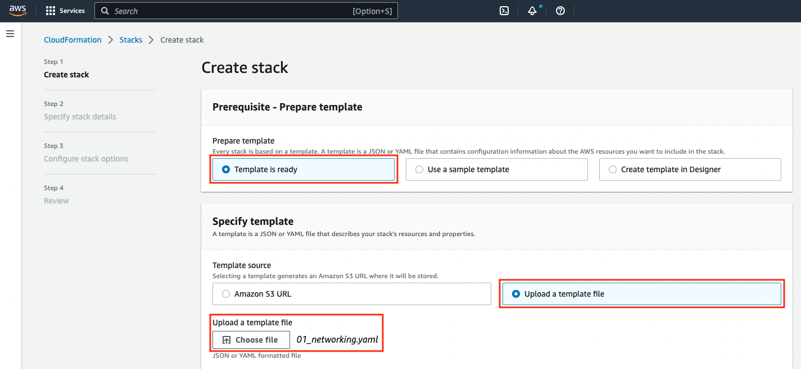

# Setup your AWS Account

> ⚠️ **Warning**: The following steps need to be executed **only** if you are going to use **your own AWS account** for the workshop. Please do not execute any action if an AWS account was provided by an AWS instructor.

## Prerequisites
If you are going to use your own AWS Account, we assume that you have **administrator privileges** in that account. If this is not the case, please double-check with your AWS system administrator before moving to next section.

## Choose the networking mode
Amazon SageMaker Studio allows you to configure networking in two modes:
- **Default communication with the internet:** Only traffic to Amazon EFS volume goes through the specified VPC. Non-EFS traffic goes through a VPC managed by SageMaker, which allows internet access. 
- **VPC only communication with the internet:** All traffic goes through the specified VPC. To allow the Studio notebook to access SageMaker API and runtime and other AWS services, you should  create VPC interface endpoints or provide access to the internet using a NAT gateway or via an AWS Transit Gateway that has a route to the internet.  

For this workshop, you have two options for configuring internet access. Use the folder with the corresponding name:
- **direct_mode:** Use the "default communication with the internet" to allow SageMaker domain to access the internet directly. Create a VPC for the traffic to the EFS volume.
- **vpc_mode:** Use the "VPC only communication with the internet". Create a VPC for all traffic. The traffic to the EFS volume goes through the VPC. The VPC uses interface endpoints for SageMaker API and some other AWS services. The traffic to the internet goes through an AWS Network Firewall deployed in the same VPC. The outbound traffic to the internet is not allowed unless it is allowed by AWS Network Firewall's rule groups.

Based on the networking mode you choose, you will create Workshop resources using two CloudFormation templates from the relevant folder in this repo:
- `01_networking.yaml` will create the core networking resources such as VPCs and subnets
- `02_sagemaker_studio.yaml`, will create the SageMaker Studio resources such as a SageMaker Studio domain, user profile, and applications.

## Create the resources using AWS CloudFormation

### Clone the repository
You will be using the AWS Management Console and SageMaker Studio for most of the workshop steps. The only exception is this initial step where you will need to upload the two CloudFormation templates from your computer. 

1. Clone this repository to your computer. 
2. Check the structure of the repository. Locate the `setup` folder, and navigate to the folder that represents the networking mode you have chosen. 
3. You will find two files: `01_networking.yaml` and `02_sagemaker_studio.yaml`. You will upload these files later in the setup process.

### Create the core networking resources
First, you will create the networking resources. If you use the `direct_mode` folder, the networking template will create a VPC, two public subnets, an Internet Gateway with the relevant route table and routes. If you use the `vpc_mode` folder, the networking template will create two public and four private subnets, a NAT Gateway, an AWS Network Firewall, and the appropriate route table and routes.

Follow these steps:

1. Sign into the [**AWS Management Console**](https://console.aws.amazon.com/)

2. In the upper-right corner of the AWS Management Console, confirm you are in the desired AWS region. For the instructions of these workshop we will use the **US East (N. Virginia)** [us-east-1].
   
	> You can use another region as long as the services we use for the workshop are available in the selected region. If you change the region, make sure you use the same region for all steps.

3. Open the [**AWS CloudFormation** console](https://console.aws.amazon.com/cloudformation) or choose the CloudFormation service in the menu.

4. On the AWS CloudFormation landing page, press the **Create stack** button.

	
	
5. On the **Create stack** screen, select **Template is ready** and **Upload a template file** as shown below. After selecting **Choose file**, choose `01_networking.yaml` from the relevant folder and press the **Next** button at the bottom of the screen.
	
	
	
6. On the **Specify stack details** screen, input a stack name like _endtoendml-workshop-networking_ and press **Next**.
	
	
	
7. Don't make any changes on the **Configure stack options** screen and just press **Next**.
   
8. On the final **Review endtoendml-workshop-networking** screen, scroll to the bottom without making any changes, and click the **Create Stack** button.
	
9.  AWS CloudFormation will start creating the AWS resources defined in the template. You can monitor the progress from the **Stack detail** screen. Wait a few seconds until the screen reports that the stack creation is completed successfully.

	

### Create the Amazon SageMaker Studio resources
In this section, we will create the Amazon SageMaker Studio domain and a user profile required to run this workshop. More specifically, we are going to create the following resources:

- An Amazon SageMaker Studio domain
- An Amazon SageMaker Studio user profile
- A JupyterServer app for the user profile
- A Data Science app for the user profile
- The IAM roles required to run the workshop

Please execute the following steps:

1. On the AWS CloudFormation landing page, press the **Create stack** button.
	
2. On the **Create stack** screen, select **Template is ready** and **Upload a template file** as shown below. After selecting **Choose file**, choose `02_sagemaker_studio.yaml` from the relevant folder and press the **Next** button at the bottom of the screen.
	
	
	
3. On the **Specify stack details** screen, input a stack name like _endtoendml-workshop-sagemaker_. Enter the name of the stack you created earlier (_endtoendml-workshop-networking_ if you used the value we suggested) and enter a user profile name or accept the default value. Finally, press **Next**.
	
	
	
4. Don't make any changes on the **Configure stack options** screen and just press **Next**.
   
5. On the final **Review endtoendml-workshop-sagemaker** screen, scroll to the bottom, check the checkbox informing that AWS Cloudformation might create IAM resources with custom names and click the **Create Stack** button.

	
   
6.  AWS CloudFormation will start creating the AWS resources defined in the template. You can monitor the progress from the **Stack detail** screen. Wait a few seconds until the screen reports that the stack creation is completed successfully.

	
	

## Proceed to the first module

1.  Start the workshop from <a href="../01_configure_sagemaker_studio/">**Module 01**</a>.
