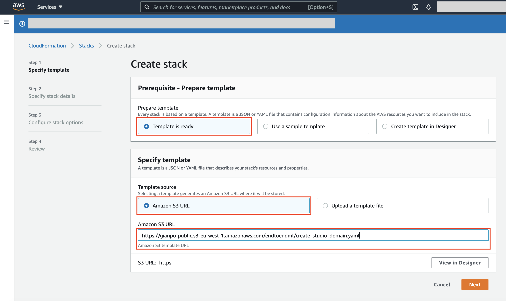
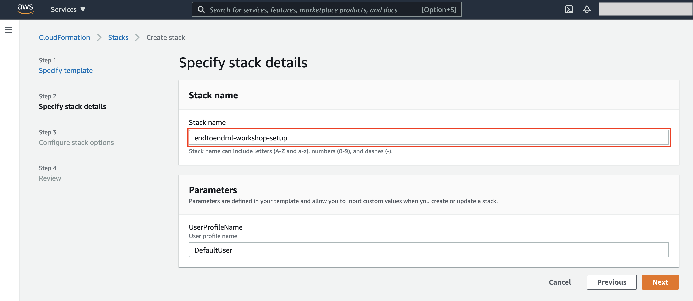

# Setup your AWS Account

> ⚠️ **Warning**: The following steps need to be executed **only** if you are going to use **your own AWS account** for the workshop. Please do not execute any action if an AWS account was provided by an AWS instructor.

## Prerequisites
If you are going to use your own AWS Account, we assume that you have **administrator privileges** on the account. If this is not the case, please double-check with your AWS system administrator before moving to next section.

## Create an Amazon SageMaker Studio domain with AWS CloudFormation
In this section, we will create the Amazon SageMaker Studio domain and a user profile required to run this workshop. More specifically, we are going to use AWS CloudFormation to create the following resources:

- An Amazon SageMaker Studio domain
- An Amazon SageMaker Studio user profile
- A Data Science app for the user profile
- The IAM roles required to run the workshop

Please execute the following steps:

1. Sign into the **AWS Management Console** at <a href="https://console.aws.amazon.com/">https://console.aws.amazon.com/</a>

2. In the upper-right corner of the AWS Management Console, confirm you are in the desired AWS region. For the instructions of these workshop we will assume using the **US East (N. Virginia)** [us-east-1], but feel free to change the region at your convenience.

	> The only constraints for changing AWS region are that we keep consistent the region settings for all services used and services are available in the selected region (please check in case you plan to execute this workshop in another AWS region).

3. Open the **AWS CloudFormation** console at <a href="https://console.aws.amazon.com/cloudformation">https://console.aws.amazon.com/cloudformation</a> or choose the CloudFormation service in the menu.

4. In the AWS CloudFormation landing page, press the **Create stack** button.

	
	
5. In the **Create stack** screen, select **Template is ready** and **Amazon S3 URL** as shown below, then copy/paste the following URL in the **Amazon S3 URL** text box:

	```
	https://gianpo-public.s3-eu-west-1.amazonaws.com/endtoendml/create_studio_domain.yaml
	```
	> **Note**: the URL targets the AWS CloudFormation template which creates the resources defined above. The template is also available in this GitHub repository for your reference <a href="create_studio_domain.yaml">here</a>.
	
	Finally, press the **Next** button at the bottom of the screen.
	
	
	
6. In the **Specify stack details** screen, input a stack name like _endtoendml-workshop-setup_ and press **Next**.
	
	
	
7. Don't specify any additional option in the **Configure stack options** screen and just press **Next**.
8. In the final **Review endtoendml-workshop-setup** screen, please scroll to the bottom, check the checkbox informing that AWS Cloudformation might create IAM resources with custom names and click the **Create Stack** button.

	
	
9. AWS CloudFormation will start creating the AWS resources defined in the template. You can monitor the progress from the **Stack detail** screen. Wait a few seconds until the screen reports that the stack creation is completed successfully.

	
	
10. Once the stack creation is completed, you can start the workshop from <a href="01_configure_sagemaker_studio/">**Module 01**</a>.